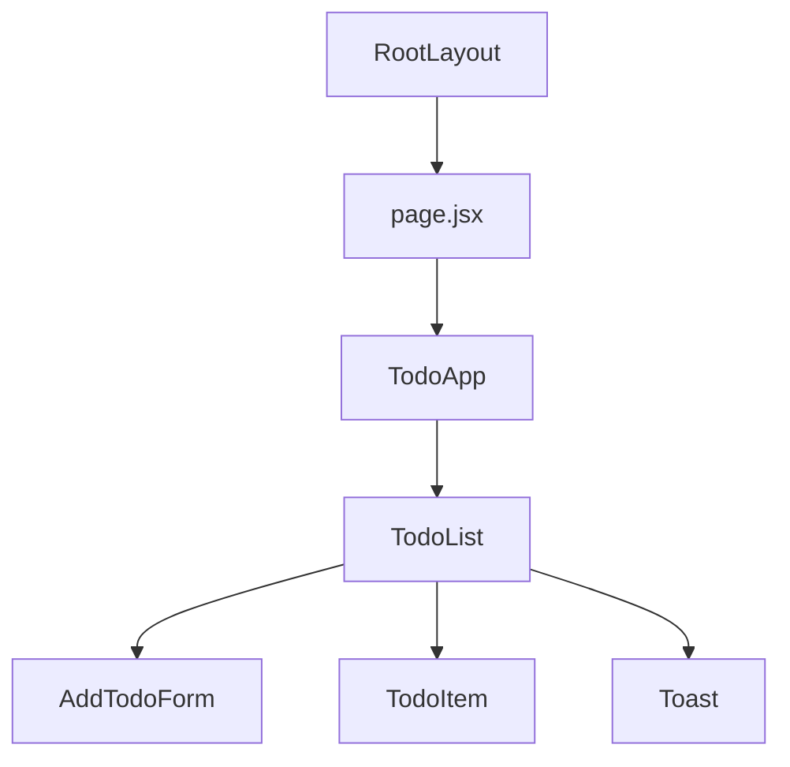
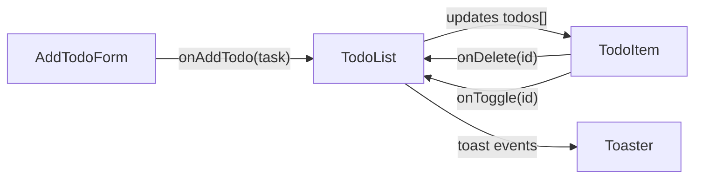

# 📝 Todo App - Task Management

Сучасний список завдань побудований на **Next.js + React** з використанням **Hooks** та **TailwindCSS**.  
Простий, стильний і зручний додаток для керування задачами з повідомленнями (**Sonner toast**) та плавною анімацією.

---

## 🚀 Стек технологій

- [Next.js 14](https://nextjs.org/) – фреймворк для React
- [React Hooks](https://react.dev/reference/react) – управління станом та логікою
- [TailwindCSS](https://tailwindcss.com/) – швидка стилізація
- [Lucide Icons](https://lucide.dev/) – сучасні іконки
- [Sonner](https://sonner.emilkowal.ski/) – повідомлення (toast)
- [nanoid](https://github.com/ai/nanoid) – генерація унікальних ID

---

## 📂 Структура проєкту

```
todo_list/
├── app/
│   ├── layout.jsx        # Головний layout з Toaster
│   ├── globals.css       # Стилі Tailwind + кастомні анімації
│   └── page.jsx          # Домашня сторінка з TodoApp
└── components/
    ├── TodoApp.jsx       # Основний контейнер
    ├── TodoList.jsx      # Логіка + список завдань
    ├── AddTodoForm.jsx   # Форма додавання
    ├── TodoItem.jsx      # Окреме завдання
    └── Toast.jsx         # Компонент сповіщення (кастомний)
```

---

## 🌳 Component Tree (CT)



---

## 🔄 Data Flow Diagram (DF)



---

## ⚙️ Основні Hooks

### `useState`
- **AddTodoForm.jsx** – керування введеним текстом форми
- **TodoList.jsx** – зберігання масиву завдань `todos[]`

### `useEffect`
- **Toast.jsx** – автоматичне закриття повідомлення через таймер

### Приклад використання:
```javascript
// У TodoList.jsx
const [todos, setTodos] = useState([])

const handleAddTodo = (task) => {
  const newTodo = {
    id: nanoid(),
    task: task.trim(),
    completed: false
  }
  setTodos((prev) => [...prev, newTodo])
}
```


## ▶️ Запуск проєкту

```bash
# 1. Клонувати репозиторій
git clone https://github.com/username/todo-app.git
cd todo-app

# 2. Встановити залежності
npm install

# 3. Запустити dev-сервер
npm run dev

# 4. Відкрити в браузері
http://localhost:3000
```

---

## 📌 Функціонал

✅ **Додавання завдань** – через форму з валідацією  
✅ **Видалення завдань** – кнопка з підтвердженням  
✅ **Позначка "виконано"** – toggle статусу  
✅ **Лічильник кількості** – відображення загальної кількості  
✅ **Toast повідомлення** – інформування про дії  
✅ **Анімації** – плавні переходи та fade-in ефекти  
✅ **Limit символів** – максимум 200 символів на завдання  

---

## 🔧 Деталі реалізації

### Управління станом
- Централізований стан в `TodoList.jsx`
- Передача функцій як props до дочірніх компонентів
- Immutable оновлення стану через `setTodos`

### Стилізація
- **TailwindCSS** для базових стилів
- **Кастомні CSS класи** для анімацій
- **CSS змінні** для кольорової схеми

### Ідентифікація
- Використання `nanoid` для унікальних ID
- Безпечна ідентифікація завдань

---

## 💡 Висновок

Цей проєкт демонструє:

- 🏗️ Побудову **Component Tree** з правильною ієрархією
- 🔄 Організацію **Data Flow** через props та callbacks
- ⚡ Використання **React Hooks** для управління станом
- 🎨 Сучасний UI з **TailwindCSS** та анімаціями
- 📱 **Responsive дизайн** для всіх пристроїв


