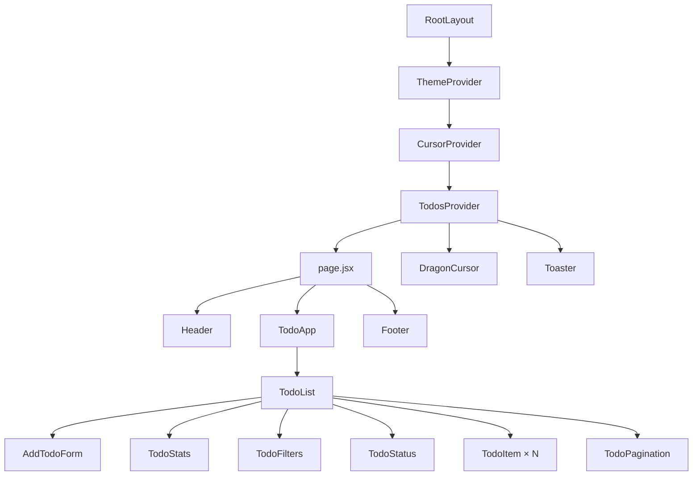
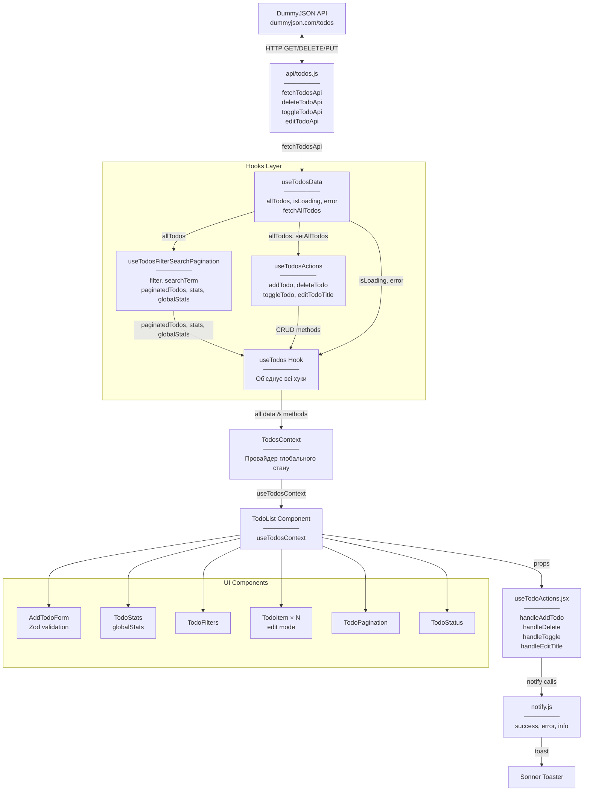

# 📝 Todo App - Task Management

Сучасний список завдань побудований на **Next.js 14 + React** з використанням **Hooks**, **TailwindCSS** та **REST API**.  
Повнофункціональний додаток для керування задачами з фільтрацією, пошуком, пагінацією та повідомленнями (**Sonner toast**).

---

## Table of Contents

- [🚀 Стек технологій](#-стек-технологій)
- [📂 Структура проєкту](#-структура-проєкту)
- [🌳 Component Tree (CT)](#-component-tree-ct)
   - [Опис Component Tree](#опис-component-tree)
- [🔄 Data Flow Diagram (DF)](#-data-flow-diagram-df)
- [📋 Опис Data Flow](#-опис-data-flow)
- [🎨 Design Patterns](#-design-patterns)
   - [1. Provider Pattern (Context API)](#1-provider-pattern-context-api)
   - [2. Custom Hook Pattern (композиція логіки)](#2-custom-hook-pattern-композиція-логіки)
   - [3. Container/Presenter Pattern (Smart/Dumb Components)](#3-containerpresenter-pattern-smartdumb-components)
   - [4. Facade Pattern (спрощення API)](#4-facade-pattern-спрощення-api)
   - [5. Observer Pattern (React Context + Hooks)](#5-observer-pattern-react-context--hooks)
   - [6. Optimistic Update Pattern](#6-optimistic-update-pattern)
   - [7. Memoization Pattern (оптимізація продуктивності)](#7-memoization-pattern-оптимізація-продуктивності)
   - [8. Validation Pattern (Zod Schema)](#8-validation-pattern-zod-schema)
   - [9. Composite Pattern (вкладені компоненти)](#9-composite-pattern-вкладені-компоненти)
   - [10. Strategy Pattern (динамічна зміна поведінки)](#10-strategy-pattern-динамічна-зміна-поведінки)
   - [11. Higher-Order Component Pattern (обгортки функціональності)](#11-higher-order-component-pattern-обгортки-функціональності)
   - [12. Singleton Pattern (Context Provider)](#12-singleton-pattern-context-provider)
   - [13. Render Props Pattern (callback functions)](#13-render-props-pattern-callback-functions)
   - [14. Debounce Pattern (оптимізація пошуку)](#14-debounce-pattern-оптимізація-пошуку)
   - [15. Module Pattern (інкапсуляція логіки)](#15-module-pattern-інкапсуляція-логіки)
- [🔄 Типові сценарії використання](#-типові-сценарії-використання)
   - [Сценарій 1: Додавання нового завдання](#сценарій-1-додавання-нового-завдання)
   - [Сценарій 2: Видалення завдання](#сценарій-2-видалення-завдання)
   - [Сценарій 3: Редагування завдання](#сценарій-3-редагування-завдання)
   - [Сценарій 4: Зміна статусу завдання](#сценарій-4-зміна-статусу-завдання)
   - [Сценарій 5: Фільтрація та пошук](#сценарій-5-фільтрація-та-пошук)
   - [Сценарій 6: Обробка помилки завантаження](#сценарій-6-обробка-помилки-завантаження)
- [⚙️ Основні Hooks](#️-основні-hooks)
- [🔌 API інтеграція](#-api-інтеграція)
   - [Модуль api/todos.js](#модуль-apitodosjs)
- [▶️ Запуск проєкту](#️-запуск-проєкту)
- [📌 Функціонал](#-функціонал)
   - [✅ Основні можливості](#-основні-можливості)
   - [🎨 Візуальні ефекти](#-візуальні-ефекти)
- [🔧 Деталі реалізації](#-деталі-реалізації)
   - [Управління станом](#управління-станом)
   - [Оптимізація продуктивності](#оптимізація-продуктивності)
   - [Обробка помилок](#обробка-помилок)
   - [Стилізація](#стилізація)
- [🎨 Кастомні анімації](#-кастомні-анімації)
- [💡 Висновок](#-висновок)
- [📝 Додаткові нотатки](#-додаткові-нотатки)
   - [Особливості архітектури](#особливості-архітектури)
   - [Можливі покращення](#можливі-покращення)

---

## 🚀 Стек технологій

- [Next.js 14](https://nextjs.org/) – React фреймворк з App Router
- [React Hooks](https://react.dev/reference/react) – useState, useEffect, useCallback, useMemo
- [React Context API](https://react.dev/reference/react/createContext) – глобальне управління станом
- [TailwindCSS v4](https://tailwindcss.com/) – utility-first стилізація
- [Axios](https://axios-http.com/) – HTTP клієнт для API запитів
- [Lucide Icons](https://lucide.dev/) – сучасна бібліотека іконок
- [Sonner](https://sonner.emilkowal.ski/) – елегантні toast повідомлення
- [Zod](https://zod.dev/) – валідація схем даних
- [DummyJSON API](https://dummyjson.com/) – тестовий REST API для завдань
- [Geist Font](https://vercel.com/font) – типографія від Vercel

---

**🔝 [Вернутися до змісту](#table-of-contents)**

---

## 📂 Структура проєкту

```
todo_list/lab4/
├── api/
│   └── todos.js              # API функції (fetch, delete, toggle, edit)
├── app/
│   ├── layout.jsx            # Root layout з провайдерами
│   ├── globals.css           # Tailwind + кастомні анімації
│   └── page.jsx              # Домашня сторінка
├── components/
│   ├── layout/
│   │   ├── Header.jsx        # Шапка з перемикачами теми/курсора
│   │   └── Footer.jsx        # Футер з інформацією
│   ├── todo/
│   │   ├── TodoApp.jsx       # Головний контейнер
│   │   ├── TodoList.jsx      # Основна логіка + рендеринг
│   │   ├── AddTodoForm.jsx   # Форма додавання з Zod валідацією
│   │   ├── TodoItem.jsx      # Окреме завдання з редагуванням
│   │   ├── TodoFilters.jsx   # Фільтри + пошук
│   │   ├── TodoStatus.jsx    # Стани: loading, error, empty
│   │   ├── TodoPagination.jsx # Пагінація
│   │   ├── TodoStats.jsx     # Статистика та прогрес-бар
│   │   └── useTodoActions.jsx # Обробники подій
│   └── ui/
│       ├── DragonCursor.jsx  # Кастомний Canvas курсор
│       └── LoadingSpinner.jsx # Компонент завантаження
├── contexts/
│   ├── ThemeContext.jsx      # Контекст теми (light/dark)
│   ├── CursorContext.jsx     # Контекст кастомного курсора
│   └── TodosContext.jsx      # Контекст для todos
├── hooks/
│   ├── useTodos.jsx          # Головний хук (об'єднує інші)
│   ├── useTodosData.jsx      # Завантаження даних з API
│   ├── useTodosActions.jsx   # CRUD операції
│   ├── useTodosFilterSearchPagination.jsx # Фільтрація/пошук/пагінація
│   └── useDebounce.jsx       # Debounce хук
└── lib/utils/
    └── notify.js             # Обгортки для Sonner toast
    
    
```

**🔝 [Вернутися до змісту](#table-of-contents)**

---

## 🌳 Component Tree (CT)



### Опис Component Tree

Ця діаграма відображає **ієрархічну структуру компонентів** додатку:

- **RootLayout** – кореневий компонент Next.js (`app/layout.jsx`), який обгортає весь додаток провайдерами контексту.

- **ThemeProvider** → **CursorProvider** → **TodosProvider** – вкладені Context провайдери для управління глобальним станом:
   - `ThemeProvider` – світла/темна тема
   - `CursorProvider` – увімкнення/вимкнення кастомного курсора
   - `TodosProvider` – глобальний стан todos через `useTodos` хук

- **DragonCursor** – Canvas компонент, який рендерить анімований курсор-дракон

- **Toaster** – глобальний компонент від Sonner для toast-повідомлень (position="top-right")

- **page.jsx** – головна сторінка з трьома секціями:
   - **Header** – логотип + перемикачі теми/курсора
   - **TodoApp** → **TodoList** – основний функціонал
   - **Footer** – інформація про проєкт

- **TodoList** – центральний компонент, який отримує дані з `useTodosContext()` та рендерить:
   - **AddTodoForm** – форма з Zod валідацією
   - **TodoStats** – картки статистики + прогрес-бар
   - **TodoFilters** – кнопки фільтрації + пошук
   - **TodoStatus** – стани loading/error/empty
   - **TodoItem × N** – список завдань з можливістю редагування
   - **TodoPagination** – навігація по сторінках

**Особливості структури:**
- Використання Context API для уникнення prop drilling
- Однонаправлений потік даних (top-down)
- Компоненти максимально декомпозовані та переповторно використовувані

---
**🔝 [Вернутися до змісту](#table-of-contents)**

---

## 🔄 Data Flow Diagram (DF)



---

## 📋 Опис Data Flow

Ця діаграма показує **рух даних та взаємодію між різними частинами додатку**.

---

### 1️⃣ Зовнішній API шар

**DummyJSON API** – зовнішнє джерело даних (`https://dummyjson.com/todos`)

**api/todos.js** – проміжний шар абстракції з чотирма функціями:

```javascript
const API_BASE = "https://dummyjson.com/todos"

export const fetchTodosApi = async (limit = 20, skip = 0) => {
    const res = await axios.get(`${API_BASE}?limit=${limit}&skip=${skip}`)
    return {
        todos: res.data?.todos || [],
        total: res.data?.total || 0
    }
}

export const deleteTodoApi = async (id) => {
    if (String(id).startsWith("local_")) return
    await axios.delete(`${API_BASE}/${id}`)
}

export const toggleTodoApi = async (id, completed) => {
    if (String(id).startsWith("local_")) return
    const res = await axios.put(`${API_BASE}/${id}`, { completed })
    return res.data
}

export const editTodoApi = async (id, newTitle) => {
    if (String(id).startsWith("local_")) {
        return { id, todo: newTitle }
    }
    const res = await axios.put(`${API_BASE}/${id}`, { todo: newTitle })
    return res.data
}
```

**Важливо:** API функції **ігнорують локальні завдання** (id що починаються з `local_`)

---

### 2️⃣ Hooks Layer (багатошаровий custom hook)

#### **useTodosData.jsx** – Завантаження даних

```javascript
export function useTodosData() {
    const [allTodos, setAllTodos] = useState([]); // ВСІ todos
    const [isLoading, setIsLoading] = useState(false);
    const [error, setError] = useState(null);

    const fetchAllTodos = useCallback(async () => {
        setIsLoading(true);
        setError(null);
        try {
            // Спочатку дізнаємося скільки всього
            const firstRes = await fetchTodosApi(1, 0);
            const totalCount = firstRes.total || 0;

            // Потім завантажуємо всі
            const allRes = await fetchTodosApi(totalCount > 0 ? totalCount : 200, 0);
            const fetchedTodos = (allRes.todos || []).map((t) => ({
                ...t,
                id: String(t.id),
                todo: t.todo || t.task || `Задача ${t.id}`
            }));

            setAllTodos(fetchedTodos);
        } catch (err) {
            console.error(err);
            setError(err);
        } finally {
            setIsLoading(false);
        }
    }, []);

    useEffect(() => {
        fetchAllTodos();
    }, [fetchAllTodos]);

    return {
        allTodos,
        setAllTodos,
        isLoading,
        error,
        fetchAllTodos
    };
}
```

**Відповідальність:**
- Завантажує **ВСІ** todos з API одним запитом
- Управляє станами loading та error
- Надає `fetchAllTodos` для повторного завантаження

---

#### **useTodosActions.jsx** – CRUD операції

```javascript
export function useTodosActions(allTodos, setAllTodos, updateGlobalStats, setIsLoading, setError) {
    const addTodo = useCallback((task) => {
        const newTodo = { id: `local_${Date.now()}`, todo: task, completed: false };
        setAllTodos((prev) => {
            const updated = [newTodo, ...prev];
            updateGlobalStats(updated);
            return updated;
        });
        return newTodo;
    }, [setAllTodos, updateGlobalStats]);

    const deleteTodo = useCallback(async (id) => {
        setIsLoading(true); setError(null);
        try {
            if (!String(id).startsWith("local_")) await deleteTodoApi(id);
            setAllTodos((prev) => {
                const updated = prev.filter((t) => String(t.id) !== String(id));
                updateGlobalStats(updated);
                return updated;
            });
        } catch (err) { setError(err); throw err; } finally { setIsLoading(false); }
    }, [setAllTodos, updateGlobalStats]);

    const toggleTodo = useCallback(async (id) => {
        setIsLoading(true); setError(null);
        try {
            const found = allTodos.find((t) => String(t.id) === String(id));
            const newCompleted = !found?.completed;
            if (!String(id).startsWith("local_")) await toggleTodoApi(id, newCompleted);
            setAllTodos((prev) => {
                const updated = prev.map((t) => String(t.id) === String(id) ? { ...t, completed: newCompleted } : t);
                updateGlobalStats(updated);
                return updated;
            });
        } catch (err) { setError(err); throw err; } finally { setIsLoading(false); }
    }, [allTodos, setAllTodos, updateGlobalStats]);

    const editTodoTitle = useCallback(async (id, newTitle) => {
        setIsLoading(true); setError(null);
        try {
            let newText = newTitle;
            if (!String(id).startsWith("local_")) {
                const updated = await editTodoApi(id, newTitle);
                newText = updated.todo || updated.title || newTitle;
            }
            setAllTodos((prev) => prev.map((t) => String(t.id) === String(id) ? { ...t, todo: newText } : t));
            return newText;
        } catch (err) { setError(err); throw err; } finally { setIsLoading(false); }
    }, [setAllTodos]);

    return { addTodo, deleteTodo, toggleTodo, editTodoTitle };
}
```

**Відповідальність:**
- `addTodo` – додає локальне завдання з префіксом `local_`
- `deleteTodo` – оптимістично видаляє зі стану, потім викликає API
- `toggleTodo` – змінює статус completed
- `editTodoTitle` – редагує текст завдання

**Важливо:** Всі методи **НЕ робять rollback** при помилці, тільки пробрасують error вгору.

---

#### **useTodosFilterSearchPagination.jsx** – Клієнтська обробка

```javascript
export function useTodosFilterSearchPagination(allTodos, options = { initialLimit: 10 }) {
    const [filter, setFilter] = useState("all");
    const [searchTerm, setSearchTerm] = useState("");
    const [currentPage, setCurrentPage] = useState(1);
    const [limitPerPage, setLimitPerPage] = useState(options.initialLimit);

    // КРОК 1: Фільтруємо ВСІ todos (active/completed)
    const filteredTodos = useMemo(() => {
        let result = [...allTodos];
        if (filter === "active") result = result.filter((t) => !t.completed);
        else if (filter === "completed") result = result.filter((t) => t.completed);
        return result;
    }, [allTodos, filter]);

    // КРОК 2: Пошук на відфільтрованих todos
    const searchedTodos = useMemo(() => {
        const q = (searchTerm || "").trim().toLowerCase();
        if (!q) return filteredTodos;

        return filteredTodos.filter((t) =>
            String(t.todo || t.task || "").toLowerCase().includes(q)
        );
    }, [filteredTodos, searchTerm]);

    // КРОК 3: Пагінація на результатах пошуку
    const paginatedTodos = useMemo(() => {
        if (limitPerPage === -1) return searchedTodos;
        const start = (currentPage - 1) * limitPerPage;
        return searchedTodos.slice(start, start + limitPerPage);
    }, [searchedTodos, currentPage, limitPerPage]);

    // Загальна кількість сторінок
    const totalPages = useMemo(() => {
        if (limitPerPage === -1) return 1;
        return Math.max(1, Math.ceil(searchedTodos.length / limitPerPage));
    }, [searchedTodos, limitPerPage]);

    // Статистика на результатах пошуку
    const stats = useMemo(() => {
        const total = searchedTodos.length;
        const completed = searchedTodos.filter((t) => t.completed).length;
        return { total, completed, remaining: total - completed };
    }, [searchedTodos]);

    // Глобальна статистика (ВСІ завдання)
    const globalStats = useMemo(() => {
        const total = allTodos.length;
        const completed = allTodos.filter((t) => t.completed).length;
        return { total, completed, remaining: total - completed };
    }, [allTodos]);

    // Автоматично повертаємось на першу сторінку
    useEffect(() => {
        if (currentPage > totalPages && totalPages > 0) {
            setCurrentPage(totalPages);
        }
    }, [totalPages, currentPage]);

    const goToNextPage = () => setCurrentPage((p) => Math.min(totalPages, p + 1));
    const goToPrevPage = () => setCurrentPage((p) => Math.max(1, p - 1));

    const setLimit = (limit) => {
        setLimitPerPage(limit);
        setCurrentPage(1);
    };

    return {
        filter, setFilter,
        searchTerm, setSearchTerm,
        currentPage, totalPages,
        paginatedTodos, stats, globalStats,
        goToNextPage, goToPrevPage,
        setLimit, limitPerPage,
        totalTodos: searchedTodos.length
    };
}
```

**Відповідальність:**
- Фільтрація (all/active/completed)
- Пошук по тексту завдання
- Пагінація з динамічним розміром сторінки
- Обчислення **двох видів статистики**:
   - `stats` – для поточних результатів (з урахуванням пошуку/фільтру)
   - `globalStats` – для всіх завдань (використовується в TodoStats)

---

#### **useTodos.jsx** – Головний хук (композиція)

```javascript
export default function useTodos(initialLimit = 10) {
    const { allTodos, setAllTodos, isLoading, error, fetchAllTodos } = useTodosData();

    const {
        filter, setFilter,
        searchTerm, setSearchTerm,
        currentPage, totalPages,
        paginatedTodos, stats, globalStats,
        goToNextPage, goToPrevPage,
        setLimit, limitPerPage, totalTodos
    } = useTodosFilterSearchPagination(allTodos, { initialLimit });

    const [loading, setLoading] = useState(false);
    const [err, setErr] = useState(null);

    const updateGlobalStats = () => {}; 

    const { addTodo, deleteTodo, toggleTodo, editTodoTitle } =
        useTodosActions(allTodos, setAllTodos, updateGlobalStats, setLoading, setErr);

    return {
        todos: paginatedTodos,
        isLoading, error,
        addTodo, deleteTodo, toggleTodo, editTodoTitle,
        limitPerPage, searchTerm, setSearchTerm,
        filter, setFilter,
        currentPage, totalPages, totalTodos,
        goToNextPage, goToPrevPage, setLimit,
        refresh: fetchAllTodos,
        stats,        // Для TodoFilters (поточні результати)
        globalStats,  // Для TodoStats (всі завдання)
    };
}
```

**Відповідальність:**
- Об'єднує три хуки в один інтерфейс
- Надає всі необхідні дані та методи для UI

---

### 3️⃣ Context Layer

#### **TodosContext.jsx**

```javascript
const TodosContext = createContext(null)

export function TodosProvider({ children }) {
    const todos = useTodosApi()
    return <TodosContext.Provider value={todos}>{children}</TodosContext.Provider>
}

export function useTodosContext() {
    const context = useContext(TodosContext)
    if (!context) {
        throw new Error("useTodosContext must be used within a TodosProvider")
    }
    return context
}
```

**Відповідальність:**
- Надає глобальний доступ до `useTodos` через Context API
- Уникає prop drilling
- Викидає помилку якщо використовується поза провайдером

---

### 4️⃣ Головний компонент (TodoList)

```javascript
export default function TodoList() {
    const {
        todos,
        isLoading, error,
        addTodo, deleteTodo, toggleTodo, editTodoTitle,
        refresh,
        currentPage, limitPerPage, totalTodos, totalPages,
        goToNextPage, goToPrevPage, setLimit,
        searchTerm, setSearchTerm,
        filter, setFilter,
        stats,
        globalStats,
    } = useTodos(10)

    const { handleAddTodo, handleDelete, handleToggle, handleEditTitle } = useTodoActions({
        addTodo, deleteTodo, toggleTodo, editTodoTitle,
    })

    const todoItems = useMemo(
        () =>
            todos.map((todo, index) => (
                <TodoItem
                    key={todo.id}
                    id={todo.id}
                    task={todo.todo || todo.task}
                    completed={todo.completed}
                    onDelete={handleDelete}
                    onToggle={handleToggle}
                    onEditTitle={handleEditTitle}
                    index={index}
                />
            )),
        [todos],
    )

    return (
        <div className="space-y-6">
            <AddTodoForm onAdd={handleAddTodo} />
            <TodoStats globalStats={globalStats} />
            <TodoFilters
                filter={filter}
                setFilter={setFilter}
                query={searchTerm}
                setQuery={setSearchTerm}
                remaining={stats.remaining}
            />
            <TodoStatus
                status={isLoading ? "loading" : error ? "error" : todos.length === 0 ? "empty" : "ok"}
                message={error ? String(error.message || error) : "Немає завдань за критеріями"}
                onRetry={refresh}
            />
            {todos.length > 0 && <div className="space-y-2">{todoItems}</div>}
            {totalTodos > 0 && (
                <TodoPagination
                    currentPage={currentPage}
                    totalPages={totalPages}
                    limitPerPage={limitPerPage}
                    setLimit={setLimit}
                    goToNextPage={goToNextPage}
                    goToPrevPage={goToPrevPage}
                    totalItems={totalTodos}
                />
            )}
        </div>
    )
}
```

**Відповідальність:**
- Отримує всі дані з `useTodosContext()`
- Використовує `useTodoActions` для обробки callbacks
- Мемоізує рендеринг `TodoItem` через `useMemo`
- Передає `globalStats` в `TodoStats` (важливо!)
- Передає `stats.remaining` в `TodoFilters`

---

### 5️⃣ UI Components (дочірні компоненти)

#### **AddTodoForm.jsx**

```javascript
const todoSchema = z.object({
    task: z
        .string()
        .trim()
        .min(3, "Завдання повинно містити щонайменше 3 символи")
        .max(100, "Завдання не може перевищувати 100 символів"),
})

export default function AddTodoForm({ onAdd }) {
    const [task, setTask] = useState("")
    const [isFocused, setIsFocused] = useState(false)
    const [error, setError] = useState("")

    const handleSubmit = (e) => {
        e.preventDefault()

        const result = todoSchema.safeParse({ task })

        if (!result.success) {
            const message = result.error.issues?.[0]?.message || "Невідома помилка"
            setError(message)
            return
        }

        setError("")
        onAdd(result.data.task)
        setTask("")
    }

    const charCount = task.length
    const isTooLong = charCount > 100

    return (
        <form onSubmit={handleSubmit} className="space-y-3">
            {/* input з лічильником символів */}
            {/* кнопка submit */}
        </form>
    )
}
```

**Відповідальність:**
- Валідація через **Zod schema** (3-100 символів)
- Відображення помилок валідації
- Лічильник символів з візуальним попередженням
- Викликає `onAdd(task)` при успішному submit

---

#### **TodoItem.jsx**

```javascript
const TodoItem = memo(function TodoItem({ id, task, completed, onToggle, onDelete, onEditTitle, index = 0 }) {
    const [isEditing, setIsEditing] = useState(false)
    const [draft, setDraft] = useState(task || "")
    const [isHovered, setIsHovered] = useState(false)

    const startEdit = useCallback(() => {
        setDraft(task || "")
        setIsEditing(true)
    }, [task])

    const cancelEdit = useCallback(() => {
        setIsEditing(false)
        setDraft(task || "")
    }, [task])

    const saveEdit = useCallback(async () => {
        const trimmed = (draft || "").trim()
        if (!trimmed) return
        await onEditTitle(id, trimmed)
        setIsEditing(false)
    }, [draft, id, onEditTitle])

    return (
        <li className="group relative overflow-hidden rounded-2xl">
            {/* checkbox для toggle */}
            {/* текст або input для редагування */}
            {/* кнопки Edit/Delete або Save/Cancel */}
        </li>
    )
})
```

**Відповідальність:**
- Режим редагування з локальним станом `isEditing`
- Кнопка checkbox → викликає `onToggle(id)`
- Кнопка Edit → переходить в режим редагування
- Кнопка Save → викликає `onEditTitle(id, newText)`
- Кнопка Delete → викликає `onDelete(id)`
- Мемоізований через `React.memo`

---

#### **TodoStats.jsx**

```javascript
export default function TodoStats({ globalStats }) {
    const { total, completed, remaining } = globalStats;
    const completionRate = total > 0 ? Math.round((completed / total) * 100) : 0;

    const stats = [
        {
            icon: ListTodo,
            label: "Всього",
            value: total,
            gradient: "from-blue-500 to-cyan-500",
            shadowColor: "shadow-blue-500/30",
        },
        {
            icon: Clock,
            label: "Активні",
            value: remaining,
            gradient: "from-amber-500 to-orange-500",
            shadowColor: "shadow-amber-500/30",
        },
        {
            icon: CheckCircle2,
            label: "Виконано",
            value: completed,
            gradient: "from-green-500 to-emerald-500",
            shadowColor: "shadow-green-500/30",
        },
    ]

    return (
        <div className="space-y-4">
            {/* Три картки з іконками */}
            ```javascript
            <div className="grid grid-cols-1 sm:grid-cols-3 gap-4">
                {stats.map((stat, index) => (
                    <div key={stat.label} className="glass-card rounded-2xl p-5 hover-lift animate-scale-in">
                        {/* stat cards */}
                    </div>
                ))}
            </div>

            {/* Прогрес-бар */}
            {total > 0 && (
                <div className="glass-card rounded-2xl p-5 space-y-3">
                    <div className="flex items-center justify-between">
                        <span>Прогрес виконання</span>
                        <span className="text-2xl font-bold gradient-text">{completionRate}%</span>
                    </div>
                    <div className="relative h-4 bg-muted rounded-full overflow-hidden">
                        <div
                            className="h-full gradient-bg transition-all duration-1000"
                            style={{ width: `${completionRate}%` }}
                        />
                    </div>
                </div>
            )}
        </div>
    )
}
```

**Відповідальність:**
- Відображає **глобальну статистику** (всі завдання, не залежить від фільтрів/пошуку)
- Три картки: Всього / Активні / Виконано
- Прогрес-бар з анімованою зміною ширини
- Обчислює `completionRate` = (completed / total) * 100

**Важливо:** Використовує `globalStats`, а не `stats`!

---

#### **TodoFilters.jsx**

```javascript
export default function TodoFilters({ filter, setFilter, query, setQuery, remaining }) {
    const filters = [
        { id: "all", label: "Усі", emoji: "📋" },
        { id: "active", label: "Активні", emoji: "⚡" },
        { id: "completed", label: "Виконані", emoji: "✅" },
    ]

    return (
        <div className="space-y-4">
            {/* Input для пошуку */}
            <div className="relative">
                <Search className="absolute left-4 top-1/2 -translate-y-1/2 w-5 h-5" />
                <input
                    type="text"
                    placeholder="Пошук завдань..."
                    value={query}
                    onChange={(e) => setQuery(e.target.value)}
                    className="w-full pl-12 pr-4 py-3 rounded-xl"
                />
            </div>

            {/* Кнопки фільтрів */}
            <div className="flex flex-wrap items-center gap-3">
                <div className="flex items-center gap-2">
                    <Filter className="w-4 h-4" />
                    <span className="font-medium">Фільтр:</span>
                </div>

                <div className="flex gap-2 flex-wrap">
                    {filters.map((f) => (
                        <button
                            key={f.id}
                            onClick={() => setFilter(f.id)}
                            className={filter === f.id ? "gradient-bg" : "bg-input"}
                        >
                            <span className="mr-1">{f.emoji}</span>
                            {f.label}
                        </button>
                    ))}
                </div>

                {/* Лічильник активних завдань */}
                <div className="ml-auto">
                    <span className="text-sm text-muted-foreground">Залишилось:</span>
                    <span className="text-lg font-bold gradient-text">{remaining}</span>
                </div>
            </div>
        </div>
    )
}
```

**Відповідальність:**
- Input для live search (викликає `setQuery`)
- Три кнопки фільтрації (викликає `setFilter`)
- Відображає кількість активних завдань з `stats.remaining`

---

#### **TodoPagination.jsx**

```javascript
export default function TodoPagination({
    currentPage,
    totalPages,
    limitPerPage,
    setLimit,
    goToNextPage,
    goToPrevPage,
    totalItems,
}) {
    return (
        <div className="glass-card rounded-2xl p-4">
            <div className="flex flex-col sm:flex-row sm:items-center sm:justify-between gap-4">
                {/* Селект кількості на сторінку */}
                <div className="flex items-center gap-3">
                    <label>Показувати:</label>
                    <select
                        value={limitPerPage}
                        onChange={(e) => setLimit(Number(e.target.value))}
                    >
                        {[3, 5, 10, 20, -1].map((n) => (
                            <option key={n} value={n}>
                                {n === -1 ? "Усі" : n}
                            </option>
                        ))}
                    </select>
                </div>

                {/* Кнопки навігації */}
                {limitPerPage !== -1 && (
                    <div className="flex items-center gap-2">
                        <button onClick={goToPrevPage} disabled={currentPage === 1}>
                            <ChevronLeft className="w-5 h-5" />
                        </button>

                        <div className="px-4 py-2 rounded-lg">
                            <span className="gradient-text font-bold">{currentPage}</span>
                            <span className="text-muted-foreground"> / {totalPages}</span>
                        </div>

                        <button onClick={goToNextPage} disabled={currentPage === totalPages}>
                            <ChevronRight className="w-5 h-5" />
                        </button>
                    </div>
                )}

                {/* Загальна кількість */}
                <div className="text-sm text-muted-foreground">
                    Всього: <span className="font-bold gradient-text">{totalItems}</span>
                </div>
            </div>
        </div>
    )
}
```

**Відповідальність:**
- Селект для вибору кількості елементів (3, 5, 10, 20, Усі)
- Кнопки навігації ← → з disabled станом
- Відображення поточної сторінки та загальної кількості

---

#### **TodoStatus.jsx**

```javascript
export default function TodoStatus({ status, message, onRetry }) {
    if (status === "loading") {
        return (
            <div className="py-12">
                <LoadingSpinner />
            </div>
        )
    }

    if (status === "error") {
        return (
            <div className="glass-card rounded-2xl p-8 text-center space-y-4">
                <div className="flex justify-center">
                    <div className="p-4 rounded-full bg-destructive/10">
                        <AlertCircle className="w-12 h-12 text-destructive" />
                    </div>
                </div>
                <div>
                    <h3 className="text-lg font-semibold">Виникла помилка</h3>
                    <p className="text-sm text-muted-foreground">{message}</p>
                </div>
                <button onClick={onRetry} className="gradient-bg text-primary-foreground px-6 py-3 rounded-xl">
                    Спробувати знову
                </button>
            </div>
        )
    }

    if (status === "empty") {
        return (
            <div className="glass-card rounded-2xl p-12 text-center space-y-4">
                <div className="flex justify-center">
                    <div className="p-4 rounded-full bg-muted">
                        <Inbox className="w-12 h-12 text-muted-foreground" />
                    </div>
                </div>
                <div>
                    <h3 className="text-lg font-semibold gradient-text">Немає завдань</h3>
                    <p className="text-sm text-muted-foreground">{message || "Додайте нове завдання, щоб почати!"}</p>
                </div>
            </div>
        )
    }

    return null
}
```

**Відповідальність:**
- `loading` → показує `LoadingSpinner`
- `error` → показує помилку + кнопку "Спробувати знову" (викликає `onRetry`)
- `empty` → показує "Немає завдань"
- `ok` → нічого не рендерить

---

### 6️⃣ Обробники подій (useTodoActions.jsx)

```javascript
export function useTodoActions({ addTodo, deleteTodo, toggleTodo, editTodoTitle }) {
    const handleAddTodo = async (task) => {
        try {
            await addTodo(task)
            notify.success("Завдання додано!")
        } catch {
            notify.error("Не вдалося додати завдання")
        }
    }

    const handleDelete = async (id) => {
        try {
            await deleteTodo(id)
            notify.success("Завдання видалено")
        } catch {
            notify.error("Не вдалося видалити")
        }
    }

    const handleToggle = async (id) => {
        try {
            await toggleTodo(id)
            notify.info("Статус оновлено")
        } catch {
            notify.error("Помилка оновлення статусу")
        }
    }

    const handleEditTitle = async (id, newTitle) => {
        try {
            await editTodoTitle(id, newTitle)
            notify.success("Заголовок оновлено")
        } catch {
            notify.error("Не вдалося оновити заголовок")
        }
    }

    return { handleAddTodo, handleDelete, handleToggle, handleEditTitle }
}
```

**Відповідальність:**
- Обгортає методи з хуків у try/catch
- Показує **toast повідомлення** для кожної дії
- Використовується в `TodoList` для передачі callbacks в дочірні компоненти

---

### 7️⃣ Notifications шар

#### **notify.js**

```javascript
import { toast } from "sonner"
import { CheckCircle2, Info, AlertCircle } from "lucide-react"

export const notify = {
    success: (message) =>
        toast.success(
            <span className="flex items-center gap-2">
                <CheckCircle2 className="w-5 h-5 text-green-500" /> {message}
            </span>,
        ),
    error: (message) =>
        toast.error(
            <span className="flex items-center gap-2">
                <AlertCircle className="w-5 h-5 text-red-500" /> {message}
            </span>,
        ),
    info: (message) =>
        toast.info(
            <span className="flex items-center gap-2">
                <Info className="w-5 h-5 text-blue-500" /> {message}
            </span>,
        ),
}
```

#### **Sonner Toaster (layout.jsx)**

```javascript
export default function RootLayout({ children }) {
    return (
        <html lang="uk" suppressHydrationWarning>
            <body>
                <ThemeProvider>
                    <CursorProvider>
                        <TodosProvider>
                            {children}
                            <DragonCursor />
                            <Toaster richColors position="top-right" />
                        </TodosProvider>
                    </CursorProvider>
                </ThemeProvider>
            </body>
        </html>
    )
}
```

**Важливо:** `notify` викликається **ТІЛЬКИ з useTodoActions.jsx**, НЕ з хуків!

---

**🔝 [Вернутися до змісту](#table-of-contents)**

---
## 🎨 Design Patterns

### 1. **Provider Pattern** (Context API)

**Де використано:**
- `ThemeProvider` (contexts/ThemeContext.jsx)
- `CursorProvider` (contexts/CursorContext.jsx)
- `TodosProvider` (contexts/TodosContext.jsx)

**Код:**
```javascript
// contexts/TodosContext.jsx
const TodosContext = createContext(null)

export function TodosProvider({ children }) {
    const todos = useTodosApi()
    return <TodosContext.Provider value={todos}>{children}</TodosContext.Provider>
}

export function useTodosContext() {
    const context = useContext(TodosContext)
    if (!context) {
        throw new Error("useTodosContext must be used within a TodosProvider")
    }
    return context
}
```

**Переваги:**
- Уникає prop drilling
- Централізує глобальний стан
- Забезпечує type-safe доступ через custom hook

**Використання:**
```javascript
// app/layout.jsx
<ThemeProvider>
    <CursorProvider>
        <TodosProvider>
            {children}
        </TodosProvider>
    </CursorProvider>
</ThemeProvider>

// components/todo/TodoList.jsx
const { todos, addTodo, deleteTodo } = useTodosContext()
```

---

### 2. **Custom Hook Pattern** (композиція логіки)

**Де використано:**
- `useTodos` (hooks/useTodos.jsx) – головний хук
- `useTodosData` (hooks/useTodosData.jsx) – завантаження даних
- `useTodosActions` (hooks/useTodosActions.jsx) – CRUD операції
- `useTodosFilterSearchPagination` (hooks/useTodosFilterSearchPagination.jsx) – клієнтська обробка
- `useTodoActions` (components/todo/useTodoActions.jsx) – обробники подій
- `useDebounce` (hooks/useDebounce.jsx) – debounce утиліта

**Код:**
```javascript
// hooks/useTodos.jsx - композиція декількох хуків
export default function useTodos(initialLimit = 10) {
    const { allTodos, setAllTodos, isLoading, error, fetchAllTodos } = useTodosData();

    const {
        filter, setFilter,
        searchTerm, setSearchTerm,
        currentPage, totalPages,
        paginatedTodos, stats, globalStats,
        goToNextPage, goToPrevPage,
        setLimit, limitPerPage, totalTodos
    } = useTodosFilterSearchPagination(allTodos, { initialLimit });

    const { addTodo, deleteTodo, toggleTodo, editTodoTitle } =
        useTodosActions(allTodos, setAllTodos, updateGlobalStats, setLoading, setErr);

    return {
        todos: paginatedTodos,
        isLoading, error,
        addTodo, deleteTodo, toggleTodo, editTodoTitle,
        limitPerPage, searchTerm, setSearchTerm,
        filter, setFilter,
        currentPage, totalPages, totalTodos,
        goToNextPage, goToPrevPage, setLimit,
        refresh: fetchAllTodos,
        stats, globalStats,
    };
}
```

**Переваги:**
- Розділення відповідальності (Separation of Concerns)
- Переповторне використання логіки
- Легке тестування окремих частин
- Композиція замість успадкування

---

### 3. **Container/Presenter Pattern** (Smart/Dumb Components)

**Де використано:**
- **Container (Smart):** `TodoList.jsx` – керує логікою, станом
- **Presenters (Dumb):** `AddTodoForm`, `TodoItem`, `TodoFilters`, `TodoStats`, `TodoPagination`, `TodoStatus` – тільки UI

**Код:**
```javascript
// TodoList.jsx - Container (Smart Component)
export default function TodoList() {
    const { todos, addTodo, deleteTodo, ... } = useTodosContext()
    const { handleAddTodo, handleDelete, ... } = useTodoActions({ addTodo, deleteTodo, ... })

    return (
        <div>
            <AddTodoForm onAdd={handleAddTodo} />
            <TodoStats globalStats={globalStats} />
            {todos.map(todo => (
                <TodoItem {...todo} onDelete={handleDelete} onToggle={handleToggle} />
            ))}
        </div>
    )
}

// TodoItem.jsx - Presenter (Dumb Component)
export default function TodoItem({ id, task, completed, onToggle, onDelete, onEditTitle }) {
    return (
        <li>
            <button onClick={() => onToggle(id)}>✓</button>
            <span>{task}</span>
            <button onClick={() => onDelete(id)}>🗑️</button>
        </li>
    )
}
```

**Переваги:**
- Презентаційні компоненти легко переповторно використовувати
- Логіка відокремлена від UI
- Простіше тестувати UI компоненти

---

### 4. **Facade Pattern** (спрощення API)

**Де використано:**
- `api/todos.js` – обгортка над Axios
- `lib/utils/notify.js` – обгортка над Sonner

**Код:**
```javascript
// api/todos.js - Facade для REST API
import axios from "axios"

const API_BASE = "https://dummyjson.com/todos"

export const fetchTodosApi = async (limit = 20, skip = 0) => {
   const res = await axios.get(`${API_BASE}?limit=${limit}&skip=${skip}`)
   return {
      todos: res.data?.todos || [],
      total: res.data?.total || 0
   }
}

export const deleteTodoApi = async (id) => {
   if (String(id).startsWith("local_")) return
   await axios.delete(`${API_BASE}/${id}`)
}

export const toggleTodoApi = async (id, completed) => {
   if (String(id).startsWith("local_")) return
   const res = await axios.put(`${API_BASE}/${id}`, { completed })
   return res.data
}

export const editTodoApi = async (id, newTitle) => {
   if (String(id).startsWith("local_")) {
      return { id, todo: newTitle }
   }
   const res = await axios.put(`${API_BASE}/${id}`, { todo: newTitle })
   return res.data
}

// lib/utils/notify.js - Facade для Sonner
export const notify = {
   success: (message) =>
           toast.success(
                   <span className="flex items-center gap-2">
                      <CheckCircle2 className="w-5 h-5 text-green-500" /> {message}
                   </span>,
           ),
   error: (message) =>
           toast.error(
                   <span className="flex items-center gap-2">
                      <AlertCircle className="w-5 h-5 text-red-500" /> {message}
                   </span>,
           ),
   info: (message) =>
           toast.info(
                   <span className="flex items-center gap-2">
                      <Info className="w-5 h-5 text-blue-500" /> {message}
                   </span>,
           ),
}

```

**Переваги:**
- Приховує складність зовнішніх бібліотек
- Легко замінити Axios на fetch або Sonner на іншу бібліотеку
- Додає кастомну логіку (наприклад, ігнорування локальних id)

---

### 5. **Observer Pattern** (React Context + Hooks)

**Де використано:**
- Context API автоматично повідомляє всі підписані компоненти про зміни
- `useTodosContext()` автоматично ре-рендерить компоненти при зміні `todos`

**Код:**
```javascript
// TodosProvider підписує всіх споживачів
export function TodosProvider({ children }) {
    const todos = useTodosApi() // стан
    return <TodosContext.Provider value={todos}>{children}</TodosContext.Provider>
}

// Компоненти автоматично оновлюються при зміні todos
function TodoList() {
    const { todos } = useTodosContext() // підписка
    return todos.map(todo => <TodoItem key={todo.id} {...todo} />)
}
```

**Переваги:**
- Автоматична синхронізація UI зі станом
- Не потрібно вручну управляти підписками
- React оптимізує ре-рендери

---

### 6. **Optimistic Update Pattern**

**Де використано:**
- `useTodosActions.deleteTodo` – видаляє зі стану перед API запитом
- `useTodosActions.toggleTodo` – змінює статус перед API запитом

**Код:**
```javascript
// hooks/useTodosActions.jsx
const deleteTodo = useCallback(async (id) => {
    setIsLoading(true); setError(null);
    try {
        // ОПТИМІСТИЧНЕ ОНОВЛЕННЯ: спочатку змінюємо UI
        if (!String(id).startsWith("local_")) await deleteTodoApi(id);
        setAllTodos((prev) => {
            const updated = prev.filter((t) => String(t.id) !== String(id));
            updateGlobalStats(updated);
            return updated;
        });
    } catch (err) { 
        setError(err); 
        throw err; // НЕ робимо rollback
    } finally { 
        setIsLoading(false); 
    }
}, [setAllTodos, updateGlobalStats]);
```

**Переваги:**
- UI відгукується миттєво (не чекає на сервер)
- Покращує користувацький досвід
- Якщо API зафейлився – показуємо помилку через toast

---

### 7. **Memoization Pattern** (оптимізація продуктивності)

**Де використано:**
- `React.memo` для `TodoItem`
- `useMemo` для обчислюваних значень
- `useCallback` для мемоізації функцій

**Код:**
```javascript
// components/todo/TodoItem.jsx - React.memo
const TodoItem = memo(function TodoItem({ id, task, completed, ... }) {
    // компонент не ре-рендериться якщо props не змінились
})

// hooks/useTodosFilterSearchPagination.jsx - useMemo
const filteredTodos = useMemo(() => {
    let result = [...allTodos];
    if (filter === "active") result = result.filter((t) => !t.completed);
    else if (filter === "completed") result = result.filter((t) => t.completed);
    return result;
}, [allTodos, filter]); // перераховується тільки при зміні залежностей

// hooks/useTodosActions.jsx - useCallback
const addTodo = useCallback((task) => {
    const newTodo = { id: `local_${Date.now()}`, todo: task, completed: false };
    setAllTodos((prev) => [newTodo, ...prev]);
    return newTodo;
}, [setAllTodos]); // функція створюється один раз
```

**Переваги:**
- Запобігає зайвим ре-рендерам
- Кешує результати важких обчислень
- Покращує продуктивність на великих списках

---

### 8. **Validation Pattern** (Zod Schema)

**Де використано:**
- `AddTodoForm.jsx` – валідація через Zod schema

**Код:**
```javascript
// components/todo/AddTodoForm.jsx
import { z } from "zod"

const todoSchema = z.object({
    task: z
        .string()
        .trim()
        .min(3, "Завдання повинно містити щонайменше 3 символи")
        .max(100, "Завдання не може перевищувати 100 символів"),
})

const handleSubmit = (e) => {
    e.preventDefault()

    const result = todoSchema.safeParse({ task })

    if (!result.success) {
        const message = result.error.issues?.[0]?.message || "Невідома помилка"
        setError(message)
        return
    }

    setError("")
    onAdd(result.data.task)
    setTask("")
}
```

**Переваги:**
- Декларативна валідація
- Type-safe (якщо використовувати TypeScript)
- Детальні повідомлення про помилки
- Легко розширювати правила

---

### 9. **Composite Pattern** (вкладені компоненти)

**Де використано:**
- `TodoApp` → `TodoList` → `AddTodoForm` + `TodoFilters` + `TodoItem[]`
- Кожен компонент може містити інші компоненти

**Код:**
```javascript
// components/todo/TodoApp.jsx
export default function TodoApp() {
    return (
        <div className="max-w-4xl mx-auto">
            <h2>Ваші Завдання</h2>
            <div className="bg-card rounded-3xl p-8">
                <TodoList />
            </div>
        </div>
    )
}

// components/todo/TodoList.jsx
export default function TodoList() {
    return (
        <div>
            <AddTodoForm onAdd={handleAddTodo} />
            <TodoStats globalStats={globalStats} />
            <TodoFilters ... />
            <TodoStatus ... />
            {todos.map(todo => <TodoItem key={todo.id} {...todo} />)}
            <TodoPagination ... />
        </div>
    )
}
```

**Переваги:**
- Гнучка структура
- Легко додавати нові компоненти
- Кожен компонент відповідає за свою частину UI
---

### 10. **Strategy Pattern** (динамічна зміна поведінки)

**Де використано:**
- `TodoStatus` – вибирає різні стратегії рендерингу залежно від стану
- `TodoFilters` – різні стратегії фільтрації (all/active/completed)

**Код:**
```javascript
// components/todo/TodoStatus.jsx
export default function TodoStatus({ status, message, onRetry }) {
    if (status === "loading") {
        return (
            <div className="py-12">
                <LoadingSpinner />
            </div>
        )
    }

    if (status === "error") {
        return (
            <div className="glass-card rounded-2xl p-8 text-center space-y-4">
                <AlertCircle className="w-12 h-12 text-destructive" />
                <h3>Виникла помилка</h3>
                <p>{message}</p>
                <button onClick={onRetry}>Спробувати знову</button>
            </div>
        )
    }

    if (status === "empty") {
        return (
            <div className="glass-card rounded-2xl p-12 text-center space-y-4">
                <Inbox className="w-12 h-12 text-muted-foreground" />
                <h3>Немає завдань</h3>
                <p>{message || "Додайте нове завдання, щоб почати!"}</p>
            </div>
        )
    }

    return null
}

// hooks/useTodosFilterSearchPagination.jsx - стратегії фільтрації
const filteredTodos = useMemo(() => {
    let result = [...allTodos];
    if (filter === "active") result = result.filter((t) => !t.completed);
    else if (filter === "completed") result = result.filter((t) => t.completed);
    return result;
}, [allTodos, filter]);
```

**Переваги:**
- Легко додати нові стани/стратегії
- Код стає більш читабельним
- Кожна стратегія ізольована

---

### 11. **Higher-Order Component Pattern** (обгортки функціональності)

**Де використано:**
- `useTodoActions` – обгортає методи з хуків у try/catch + notifications

**Код:**
```javascript
// components/todo/useTodoActions.jsx
export function useTodoActions({ addTodo, deleteTodo, toggleTodo, editTodoTitle }) {
    const handleAddTodo = async (task) => {
        try {
            await addTodo(task)
            notify.success("Завдання додано!")
        } catch {
            notify.error("Не вдалося додати завдання")
        }
    }

    const handleDelete = async (id) => {
        try {
            await deleteTodo(id)
            notify.success("Завдання видалено")
        } catch {
            notify.error("Не вдалося видалити")
        }
    }

    const handleToggle = async (id) => {
        try {
            await toggleTodo(id)
            notify.info("Статус оновлено")
        } catch {
            notify.error("Помилка оновлення статусу")
        }
    }

    const handleEditTitle = async (id, newTitle) => {
        try {
            await editTodoTitle(id, newTitle)
            notify.success("Заголовок оновлено")
        } catch {
            notify.error("Не вдалося оновити заголовок")
        }
    }

    return { handleAddTodo, handleDelete, handleToggle, handleEditTitle }
}
```

**Переваги:**
- Додає cross-cutting concerns (логування, notifications)
- Не дублює try/catch в кожному компоненті
- Централізує обробку помилок

---

### 12. **Singleton Pattern** (Context Provider)

**Де використано:**
- `TodosProvider` – один екземпляр стану для всього додатку
- `ThemeProvider`, `CursorProvider` – глобальні сінглтони

**Код:**
```javascript
// app/layout.jsx - тільки один екземпляр кожного провайдера
export default function RootLayout({ children }) {
    return (
        <html lang="uk" suppressHydrationWarning>
            <body>
                <ThemeProvider>
                    <CursorProvider>
                        <TodosProvider>
                            {children}
                            <DragonCursor />
                            <Toaster richColors position="top-right" />
                        </TodosProvider>
                    </CursorProvider>
                </ThemeProvider>
            </body>
        </html>
    )
}
```

**Переваги:**
- Гарантує один екземпляр стану
- Всі компоненти працюють з однією джерелом правди
- Запобігає конфліктам стану

---

### 13. **Render Props Pattern** (callback functions)

**Де використано:**
- Всі компоненти використовують callbacks для комунікації з батьківськими компонентами

**Код:**
```javascript
// components/todo/TodoList.jsx - передає callbacks
<AddTodoForm onAdd={handleAddTodo} />

<TodoItem
    key={todo.id}
    id={todo.id}
    task={todo.todo || todo.task}
    completed={todo.completed}
    onDelete={handleDelete}
    onToggle={handleToggle}
    onEditTitle={handleEditTitle}
    index={index}
/>

<TodoFilters
    filter={filter}
    setFilter={setFilter}
    query={searchTerm}
    setQuery={setSearchTerm}
    remaining={stats.remaining}
/>
```

**Переваги:**
- Дочірні компоненти не знають про імплементацію
- Легко замінити логіку без зміни UI
- Підтримує інверсію контролю (IoC)

---

### 14. **Debounce Pattern** (оптимізація пошуку)

**Де використано:**
- `useDebounce` hook (хоча в поточному коді не використовується напряму, але створений для оптимізації)

**Код:**
```javascript
// hooks/useDebounce.jsx
import { useState, useEffect } from "react";

export function useDebounce(value, delay) {
    const [debouncedValue, setDebouncedValue] = useState(value);

    useEffect(() => {
        const handler = setTimeout(() => setDebouncedValue(value), delay);
        return () => clearTimeout(handler);
    }, [value, delay]);

    return debouncedValue;
}

```

**Переваги:**
- Зменшує кількість обчислень при швидкому введенні
- Покращує продуктивність пошуку
- Зменшує навантаження на сервер (якщо пошук через API)

---

### 15. **Module Pattern** (інкапсуляція логіки)

**Де використано:**
- Всі файли експортують публічні функції/компоненти
- Приватна логіка залишається в межах модуля

**Код:**
```javascript
// api/todos.js - приватна константа + публічні функції
const API_BASE = "https://dummyjson.com/todos" // приватна

export const fetchTodosApi = async (limit = 20, skip = 0) => { ... } // публічна
export const deleteTodoApi = async (id) => { ... } // публічна
export const toggleTodoApi = async (id, completed) => { ... } // публічна
export const editTodoApi = async (id, newTitle) => { ... } // публічна

// lib/utils/notify.js
export const notify = {
   success: (message) =>
           toast.success(
                   <span className="flex items-center gap-2">
                      <CheckCircle2 className="w-5 h-5 text-green-500" /> {message}
                   </span>,
           ),
   error: (message) =>
           toast.error(
                   <span className="flex items-center gap-2">
                      <AlertCircle className="w-5 h-5 text-red-500" /> {message}
                   </span>,
           ),
   info: (message) =>
           toast.info(
                   <span className="flex items-center gap-2">
                      <Info className="w-5 h-5 text-blue-500" /> {message}
                   </span>,
           ),
}

```

**Переваги:**
- Чиста архітектура
- Легко знайти де використовується функція
- Захищає внутрішню імплементацію

---

**🔝 [Вернутися до змісту](#table-of-contents)**

---


## 🔄 Типові сценарії використання

### Сценарій 1: Додавання нового завдання

1. Користувач вводить текст в input `AddTodoForm`
2. Натискає кнопку "Додати" (або Enter)
3. `AddTodoForm.handleSubmit`:
   - Валідує через Zod (3-100 символів)
   - Викликає `onAdd(task)` → `useTodoActions.handleAddTodo`
4. `useTodoActions.handleAddTodo`:
   - Викликає `addTodo(task)` з хука
   - Показує `notify.success("Завдання додано!")`
5. `useTodosActions.addTodo`:
   - Створює об'єкт з `id: local_${Date.now()}`
   - Додає на початок масиву `allTodos`
   - **НЕ викликає API** (це локальна операція)
6. React автоматично оновлює UI через Context

**Результат:** Нове завдання з'являється вгорі списку, зелений toast

---

### Сценарій 2: Видалення завдання

1. Користувач клікає 🗑️ в `TodoItem`
2. `TodoItem` викликає `onDelete(id)` → `useTodoActions.handleDelete`
3. `useTodoActions.handleDelete`:
   - Викликає `await deleteTodo(id)`
   - При успіху → `notify.success("Завдання видалено")`
   - При помилці → `notify.error("Не вдалося видалити")`
4. `useTodosActions.deleteTodo`:
   - **ОПТИМІСТИЧНО** видаляє зі стану: `setAllTodos(prev => prev.filter(...))`
   - Викликає `await deleteTodoApi(id)`
   - Якщо API повертає помилку → пробрасує її вгору
5. React автоматично оновлює UI через Context

**Результат:** Завдання зникає, червоний toast

**Важливо:** При помилці видалення стан НЕ відкочується назад!

---

### Сценарій 3: Редагування завдання

1. Користувач клікає кнопку Edit в `TodoItem`
2. `TodoItem` переходить в режим `isEditing = true`
3. Користувач редагує текст в input
4. Натискає Save або Enter
5. `TodoItem.saveEdit`:
   - Викликає `onEditTitle(id, newText)` → `useTodoActions.handleEditTitle`
6. `useTodoActions.handleEditTitle`:
   - Викликає `await editTodoTitle(id, newText)`
   - При успіху → `notify.success("Заголовок оновлено")`
7. `useTodosActions.editTodoTitle`:
   - Якщо локальне завдання → просто змінює в стані
   - Якщо серверне → викликає `editTodoApi(id, newText)`
   - Оновлює `allTodos`
8. `TodoItem` виходить з режиму редагування: `setIsEditing(false)`

**Результат:** Текст завдання оновлюється, зелений toast

---

### Сценарій 4: Зміна статусу завдання

1. Користувач клікає checkbox в `TodoItem`
2. `TodoItem` викликає `onToggle(id)` → `useTodoActions.handleToggle`
3. `useTodoActions.handleToggle`:
   - Викликає `await toggleTodo(id)`
   - При успіху → `notify.info("Статус оновлено")`
4. `useTodosActions.toggleTodo`:
   - **ОПТИМІСТИЧНО** змінює статус: `setAllTodos(prev => prev.map(...))`
   - Викликає `await toggleTodoApi(id, newCompleted)`
   - При помилці → пробрасує error
5. React автоматично оновлює UI

**Результат:** Checkbox змінюється, текст перекреслюється, синій toast

---

### Сценарій 5: Фільтрація та пошук

1. Користувач вводить текст в input `TodoFilters`
2. `onChange` викликає `setSearchTerm(e.target.value)`
3. `useTodosFilterSearchPagination`:
   - `searchedTodos` (useMemo) перераховується
   - Фільтрує по `filteredTodos` → пошук по тексту
   - `useEffect` скидає `currentPage` на 1
4. `paginatedTodos` оновлюється відповідно до нової сторінки
5. `TodoList` отримує оновлені `todos` через Context
6. React автоматично оновлює список `TodoItem`

**Результат:** Список показує тільки завдання, що містять пошуковий запит

---

### Сценарій 6: Обробка помилки завантаження

1. При монтуванні `useTodosData` викликає `fetchAllTodos()`
2. Якщо API недоступний → `catch (err) { setError(err) }`
3. `TodoList` отримує `error !== null`
4. `TodoStatus` рендерить стан "error":
   - Іконка AlertCircle
   - Текст помилки
   - Кнопка "Спробувати ще раз"
5. Користувач клікає кнопку → викликається `refresh()`
6. `refresh` → `fetchAllTodos()` → повторний запит до API

**Результат:** Можливість повторного завантаження при проблемах з мережею

---

## ⚙️ Основні Hooks

### `useState`
- **AddTodoForm** – `task` (текст форми), `isFocused`, `error`
- **TodoItem** – `isEditing`, `draft`, `isHovered`
- **TodoList** – отримує весь стан через Context
- **useTodosData** – `allTodos`, `isLoading`, `error`
- **useTodosFilterSearchPagination** – `filter`, `searchTerm`, `currentPage`, `limitPerPage`
- **ThemeContext** – `theme`, `mounted`
- **CursorContext** – `cursorEnabled`

### `useEffect`
- **useTodosData** – автоматичне завантаження завдань при монтуванні
- **useTodosFilterSearchPagination** – скидання сторінки при зміні фільтра/пошуку
- **useDebounce** – таймер для затримки виконання
- **DragonCursor** – ініціалізація Canvas анімації
- **ThemeContext** – застосування dark mode класів до DOM

### `useCallback`
- **useTodosData** – `fetchAllTodos` (запобігає повторному створенню функції)
- **useTodosActions** – `addTodo`, `deleteTodo`, `toggleTodo`, `editTodoTitle`
- **TodoItem** – `startEdit`, `cancelEdit`, `saveEdit`
- **ThemeContext** – `toggleTheme`
- **CursorContext** – `toggleCursor`

### `useMemo`
- **useTodosFilterSearchPagination** – `filteredTodos`, `searchedTodos`, `paginatedTodos`, `totalPages`, `stats`, `globalStats`
- **TodoList** – `todoItems` (мемоізація списку компонентів)
- **ThemeContext** – `value` (мемоізація контексту)
- **CursorContext** – `value` (мемоізація контексту)

### `useContext`
- **useTodosContext** – доступ до TodosContext
- **useTheme** – доступ до ThemeContext
- **useCursor** – доступ до CursorContext

### `useRef`
- **DragonCursor** – `canvasRef`, `animationRef`, `dragonRef`, `trailsRef`, `targetRef`

### `React.memo`
- **TodoItem** – запобігає ре-рендеру якщо props не змінились

---
**🔝 [Вернутися до змісту](#table-of-contents)**

---

## 🔌 API інтеграція

### Модуль `api/todos.js`

```javascript
import axios from "axios"

const API_BASE = "https://dummyjson.com/todos"

// Завантаження списку завдань з підтримкою пагінації
export const fetchTodosApi = async (limit = 20, skip = 0) => {
    const res = await axios.get(`${API_BASE}?limit=${limit}&skip=${skip}`)
    return {
        todos: res.data?.todos || [],
        total: res.data?.total || 0
    }
}

// Видалення завдання
export const deleteTodoApi = async (id) => {
    if (String(id).startsWith("local_")) return // Локальні не видаляємо
    await axios.delete(`${API_BASE}/${id}`)
}

// Зміна статусу
export const toggleTodoApi = async (id, completed) => {
    if (String(id).startsWith("local_")) return
    const res = await axios.put(`${API_BASE}/${id}`, { completed })
    return res.data
}

// Редагування тексту завдання
export const editTodoApi = async (id, newTitle) => {
    if (String(id).startsWith("local_")) {
        return { id, todo: newTitle }
    }
    const res = await axios.put(`${API_BASE}/${id}`, { todo: newTitle })
    return res.data
}
```

**Особливості:**
- Локальні завдання (`local_*`) не надсилаються до API
- `fetchTodosApi` повертає `{ todos, total }` для пагінації
- `editTodoApi` підтримує локальні завдання
- Axios обробляє помилки через try/catch в хуках

---
**🔝 [Вернутися до змісту](#table-of-contents)**

---

## ▶️ Запуск проєкту

```bash
# 1. Клонувати репозиторій
git clone https://github.com/Hyptofon/todo_list.git
cd todo-app/lab4

# 2. Встановити залежності
npm install

# 3. Запустити dev-сервер
npm run dev

# 4. Відкрити в браузері
http://localhost:3000
```

---

## 📌 Функціонал

### ✅ Основні можливості
- **Завантаження з API** – завантажує ВСІ завдання одним запитом
- **Додавання завдань** – Zod валідація (3-100 символів), лічильник
- **Видалення** – оптимістичне оновлення UI + toast
- **Редагування** – inline editing з режимом Save/Cancel
- **Toggling статусу** – позначка виконано/активно
- **Фільтрація** – Усі / Активні / Виконані
- **Пошук** – live search по тексту завдання
- **Пагінація** – 3/5/10/20 або "Усі" на сторінці
- **Статистика** – глобальна статистика + прогрес-бар
- **Toast повідомлення** – Sonner для всіх дій
- **Теми** – світла/темна з плавним переходом
- **Кастомний курсор** – анімований дракон на Canvas
- **Responsive дизайн** – адаптивний на всіх екранах

### 🎨 Візуальні ефекти
- **Glass morphism** – напівпрозорі картки з blur
- **Gradient backgrounds** – багатокольорові градієнти
- **Smooth animations** – fade-in, slide-up, scale-in
- **Hover effects** – lift effect з тінями
- **Loading spinner** – багаторівневий обертальний індикатор
- **Progress bar** – анімований прогрес виконання
- **Task animations** – плавне перетворення при зміні статусу
- **Dragon cursor** – Canvas анімація з trailing effect
- **Dark mode** – підтримка темної теми з oklch кольорами

---
**🔝 [Вернутися до змісту](#table-of-contents)**

---

## 🔧 Деталі реалізації

### Управління станом
```javascript
// Глобальний стан через Context
const TodosContext = createContext(null)

export function TodosProvider({ children }) {
    const todos = useTodosApi() // весь стан + методи
    return <TodosContext.Provider value={todos}>{children}</TodosContext.Provider>
}

// Локальний стан в хуках
const [allTodos, setAllTodos] = useState([])
const [filter, setFilter] = useState("all")
const [searchTerm, setSearchTerm] = useState("")
const [currentPage, setCurrentPage] = useState(1)

// Immutable оновлення стану
setAllTodos((prev) => [newTodo, ...prev])
setAllTodos((prev) => prev.filter((t) => String(t.id) !== String(id)))
setAllTodos((prev) => prev.map((t) => 
  String(t.id) === String(id) ? { ...t, completed: !t.completed } : t
))
```

### Оптимізація продуктивності
- **useCallback** – запобігання повторному створенню функцій
- **useMemo** – кешування відфільтрованих результатів
- **React.memo** – запобігання ре-рендеру TodoItem
- **String conversion** – нормалізація ID для порівняння
- **Оптимістичні оновлення** – UI відгукується миттєво

### Обробка помилок
```javascript
// Централізована обробка в useTodoActions
const handleDelete = async (id) => {
  try {
    await deleteTodo(id)
    notify.success("Завдання видалено")
  } catch {
    notify.error("Не вдалося видалити")
  }
}

// API помилки пробрасуються вгору
const deleteTodo = useCallback(async (id) => {
    try {
        await deleteTodoApi(id)
        setAllTodos((prev) => prev.filter(...))
    } catch (err) { 
        setError(err)
        throw err // пробрасуємо для обробки в UI
    }
}, [])
```

### Стилізація
- **Tailwind v4** – нові `@theme inline` директиви
- **CSS змінні** – кольорова схема через `oklch()`
- **Custom classes** – `.glass-card`, `.gradient-bg`, `.hover-lift`
- **Animations** – `@keyframes` для slideUp, scaleIn, float, glow
- **Dark mode** – `.dark` клас з окремими значеннями змінних

---
**🔝 [Вернутися до змісту](#table-of-contents)**

---

## 🎨 Кастомні анімації

```css
/* Glass morphism ефект */
.glass-card {
  background: rgba(255, 255, 255, 0.95);
  border: 1px solid rgba(0, 0, 0, 0.1);
  box-shadow: 0 8px 32px rgba(139, 92, 246, 0.1);
  transition: all 0.3s cubic-bezier(0.4, 0, 0.2, 1);
  will-change: transform;
}

.dark .glass-card {
  background: rgba(23, 23, 23, 0.95);
  border: 1px solid rgba(255, 255, 255, 0.1);
  box-shadow: 0 8px 32px rgba(167, 139, 250, 0.2);
}

/* Градієнтний текст */
.gradient-text {
  background: linear-gradient(135deg, #8b5cf6 0%, #a78bfa 50%, #60a5fa 100%);
  background-clip: text;
  -webkit-background-clip: text;
  -webkit-text-fill-color: transparent;
  background-size: 100%;
}

/* Hover lift ефект */
.hover-lift {
  transition: transform 0.3s cubic-bezier(0.4, 0, 0.2, 1), 
              box-shadow 0.3s cubic-bezier(0.4, 0, 0.2, 1);
  will-change: transform;
}

.hover-lift:hover {
  transform: translateY(-4px) translateZ(0);
  box-shadow: 0 12px 40px rgba(139, 92, 246, 0.3);
}

/* Плавна поява */
@keyframes slideUp {
  from {
    opacity: 0;
    transform: translateY(20px) translateZ(0);
  }
  to {
    opacity: 1;
    transform: translateY(0) translateZ(0);
  }
}

/* Анімація масштабування */
@keyframes scaleIn {
  from {
    opacity: 0;
    transform: scale(0.95) translateZ(0);
  }
  to {
    opacity: 1;
    transform: scale(1) translateZ(0);
  }
}

/* Floating анімація */
@keyframes float {
  0%, 100% {
    transform: translateY(0) translateZ(0);
  }
  50% {
    transform: translateY(-10px) translateZ(0);
  }
}

/* Glow пульсація */
@keyframes glow {
  0%, 100% {
    box-shadow: 0 0 20px rgba(139, 92, 246, 0.3);
  }
  50% {
    box-shadow: 0 0 40px rgba(139, 92, 246, 0.6);
  }
}

/* Респект для accessibility */
@media (prefers-reduced-motion: reduce) {
  *,
  *::before,
  *::after {
    animation-duration: 0.01ms !important;
    animation-iteration-count: 1 !important;
    transition-duration: 0.01ms !important;
  }
}
```

---
**🔝 [Вернутися до змісту](#table-of-contents)**

---

## 💡 Висновок

Цей проєкт демонструє:

- 🏗️ **Модульну архітектуру** з розділенням на API/Hooks/Contexts/Components
- 🔄 **Оптимізований Data Flow** через Context API + багатошарові custom hooks
- 🎨 **15 Design Patterns** – Provider, Custom Hooks, Container/Presenter, Facade, Observer, Optimistic Update, Memoization, Validation, Composite, Strategy, HOC, Singleton, Render Props, Debounce, Module
- ⚡ **Performance optimization** з useCallback, useMemo, React.memo
- 🌐 **REST API інтеграція** з обробкою помилок та оптимістичними оновленнями
- 🎯 **Повноцінна пагінація** з фільтрацією та пошуком на клієнті
- 📊 **Два види статистики** – глобальна (всі todos) + локальна (з урахуванням фільтрів)
- 🔔 **Rich notifications** через Sonner з кастомними іконками
- 🎨 **Сучасний UI/UX** з glass morphism, градієнтами, анімаціями
- 🌙 **Dark mode** з плавними переходами
- 🐉 **Canvas animation** – кастомний курсор-дракон
- 📱 **Повністю адаптивний** на всіх пристроях
- ✅ **Zod validation** для форм
- 🔍 **Inline editing** з режимом Save/Cancel

---
**🔝 [Вернутися до змісту](#table-of-contents)**

---
## 📝 Додаткові нотатки

### Особливості архітектури:
- **Завантаження даних:** Всі todos завантажуються одним запитом (`fetchAllTodos`)
- **Локальні завдання:** Отримують префікс `local_` для відрізнення від серверних
- **Оптимістичні оновлення:** UI оновлюється одразу, не чекаючи на API
- **Два види статистики:**
   - `stats` – для поточних результатів (з урахуванням пошуку/фільтру) → використовується в `TodoFilters`
   - `globalStats` – для всіх завдань (без фільтрів) → використовується в `TodoStats`
- **Валідація:** Zod schema для тексту завдання (3-100 символів)
- **Фільтри та пошук:** Працюють незалежно, обчислюються через `useMemo`
- **Пагінація:** Клієнтська, з можливістю показати "Усі" (limit=-1)
- **Notifications:** Викликаються тільки з `useTodoActions`, не з хуків
- **Context API:** Уникає prop drilling, надає глобальний доступ до стану
- **Custom Hooks:** Композиція декількох хуків в один інтерфейс
- **Мемоізація:** Всі обчислювані значення кешуються через `useMemo`
- **Error handling:** Централізована обробка в `useTodoActions` + toast

### Можливі покращення:
- Додати debounce для пошуку через `useDebounce`
- Реалізувати серверну пагінацію замість клієнтської
- Додати drag-and-drop для переміщення завдань
- Реалізувати категорії/теги для завдань
- Додати сортування (по даті, алфавіту, пріоритету)
- Зберігати фільтри/пошук в localStorage
- Додати тести (Jest + React Testing Library)
- Міграція на TypeScript для type safety

