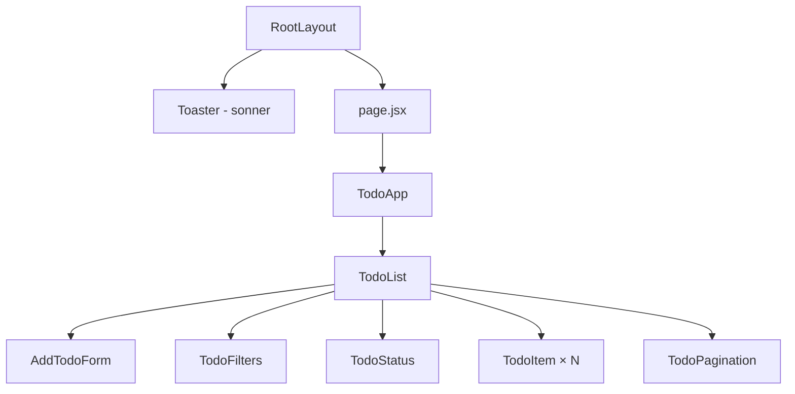
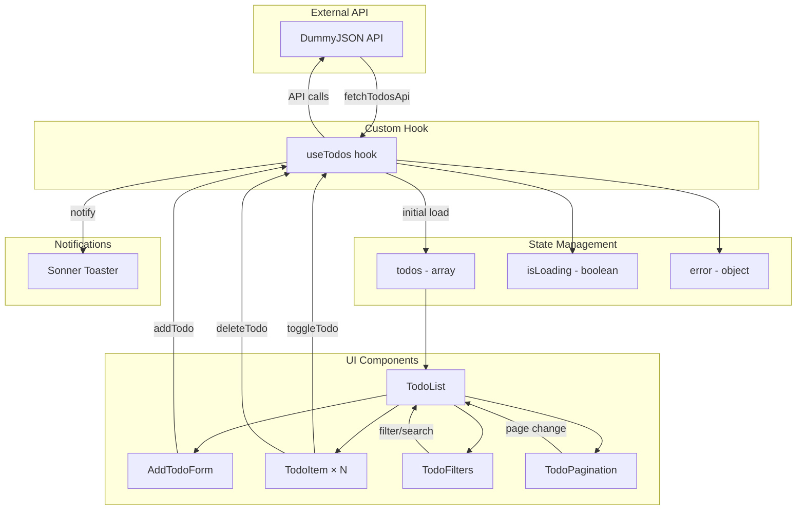

# 📝 Todo App - Task Management

Сучасний список завдань побудований на **Next.js 14 + React** з використанням **Hooks**, **TailwindCSS** та **REST API**.  
Повнофункціональний додаток для керування задачами з фільтрацією, пошуком, пагінацією та повідомленнями (**Sonner toast**).

---

## 🚀 Стек технологій

- [Next.js 14](https://nextjs.org/) – React фреймворк з App Router
- [React Hooks](https://react.dev/reference/react) – useState, useEffect, useCallback, useMemo
- [TailwindCSS v4](https://tailwindcss.com/) – utility-first стилізація
- [Axios](https://axios-http.com/) – HTTP клієнт для API запитів
- [Lucide Icons](https://lucide.dev/) – сучасна бібліотека іконок
- [Sonner](https://sonner.emilkowal.ski/) – елегантні toast повідомлення
- [DummyJSON API](https://dummyjson.com/) – тестовий REST API для завдань
- [Geist Font](https://vercel.com/font) – типографія від Vercel

---

## 📂 Структура проєкту

```
todo_list/lab4/
├── api/
│   └── todos.js              # API функції (fetch, delete, toggle)
├── app/
│   ├── layout.jsx            # Root layout з Toaster
│   ├── globals.css           # Tailwind + кастомні анімації
│   └── page.jsx              # Домашня сторінка
├── components/
│   ├── TodoApp.jsx           # Головний контейнер з заголовком
│   ├── TodoList.jsx          # Основна логіка + рендеринг
│   ├── AddTodoForm.jsx       # Форма додавання завдань
│   ├── TodoItem.jsx          # Окреме завдання (toggle/delete)
│   ├── TodoFilters.jsx       # Фільтри + пошук
│   ├── TodoStatus.jsx        # Стани: loading, error, empty
│   ├── TodoPagination.jsx    # Пагінація з вибором кількості
│   ├── Toast.jsx             # Кастомний toast (не використовується)
│   └── utils/
│       └── notify.js         # Обгортки для Sonner toast
└── hooks/
    └── useTodos.jsx          # Custom hook для роботи з API
```

---

## 🌳 Component Tree (CT)



### Опис Component Tree

Ця діаграма відображає **ієрархічну структуру компонентів** додатку:

- **RootLayout** – кореневий компонент Next.js, який обгортає весь додаток. Він містить глобальні налаштування (шрифти Geist) та підключає Toaster для відображення сповіщень.

- **Toaster**  – глобальний компонент від Sonner, який рендериться на рівні layout і відповідає за показ toast-повідомлень у правому верхньому куті екрану.

- **page.jsx** → **TodoApp** – точка входу сторінки, яка містить заголовок додатку з анімованим текстом та обгортає основну логіку в стилізовану картку.

- **TodoList** – центральний компонент, який керує всією логікою застосунку. Він містить стан (фільтри, пошук, пагінація), використовує custom hook `useTodos` та рендерить дочірні компоненти.

- **Дочірні компоненти TodoList**:
  - **AddTodoForm** – форма з інпутом та лічильником символів
  - **TodoFilters** – кнопки фільтрації (Усі/Активні/Виконані) + поле пошуку
  - **TodoStatus** – відображає стани завантаження, помилок або порожнього списку
  - **TodoItem × N** – окремі завдання, які рендеряться динамічно через `.map()`
  - **TodoPagination** – елементи керування сторінками та вибір кількості елементів

**Особливості структури:**
- Однонаправлений потік даних (top-down)
- Всі дані зберігаються в `TodoList` та передаються через props
- Компоненти максимально декомпозовані для переповторного використання

---

## 🔄 Data Flow Diagram (DF)



### Опис Data Flow

Ця діаграма показує **рух даних та взаємодію між різними частинами додатку**:

#### 1️⃣ Зовнішній API шар
- **DummyJSON API** – джерело даних, яке надає початковий список завдань та обробляє операції CRUD (читання, видалення, оновлення).

#### 2️⃣ Custom Hook шар
- **useTodos** – центральний хук, який інкапсулює всю логіку роботи з API:
  - При монтуванні компонента викликає `fetchTodosApi` для завантаження початкових даних
  - Експортує функції `addTodo`, `deleteTodo`, `toggleTodo`, `refresh`
  - Керує трьома станами: `todos[]`, `isLoading`, `error`

#### 3️⃣ State Management шар
- **TodosState** – масив усіх завдань (локальних + завантажених з API)
- **LoadingState** – булеве значення для відображення спінера
- **ErrorState** – об'єкт з інформацією про помилку (якщо виникла)

#### 4️⃣ UI Components шар
- **TodoList** отримує дані зі стану та розподіляє їх між дочірніми компонентами
- **AddForm** → викликає `addTodo()` при сабміті форми
- **TodoItem** → викликає `toggleTodo()` або `deleteTodo()` при кліку на кнопки
- **Filters** → оновлює локальний стан фільтра/пошуку в `TodoList`
- **Pagination** → змінює `currentPage` для перерахунку видимих елементів

#### 5️⃣ Notifications шар
- **Sonner Toaster** – отримує виклики через `notify.success/error/info` з `useTodos` або обробників подій у `TodoList`

#### 🔄 Типовий flow операції (наприклад, видалення завдання):
1. Користувач клікає кнопку "Видалити" в `TodoItem`
2. `TodoItem` викликає `onDelete(id)` (props функція)
3. `TodoList.handleDelete` викликає `deleteTodo(id)` з хука
4. `useTodos.deleteTodo`:
   - Оптимістично видаляє елемент зі стану (`setTodos`)
   - Надсилає DELETE запит до API через `deleteTodoApi`
   - Викликає `notify.success` для показу toast
   - У разі помилки – відкочує зміни та показує `notify.error`
5. UI автоматично оновлюється через React reactivity

**Ключові принципи:**
- ✅ Unidirectional data flow (однонаправлений потік)
- ✅ Separation of Concerns (розділення відповідальності)
- ✅ Optimistic UI updates (оптимістичне оновлення інтерфейсу)
- ✅ Централізована обробка помилок
- ✅ Реактивність через React hooks

---

## ⚙️ Основні Hooks

### `useState`
- **AddTodoForm** – `task` (текст форми), валідація довжини
- **TodoList** – `filter` (all/active/completed), `query` (пошук), `currentPage`, `perPage`
- **useTodos** – `todos[]`, `isLoading`, `error`

### `useEffect`
- **useTodos** – автоматичне завантаження завдань при монтуванні
- **TodoList** – скидання сторінки при зміні фільтра/пошуку

### `useCallback`
- **useTodos** – `fetchTodos`, `addTodo`, `deleteTodo`, `toggleTodo`, `refresh` (мемоізація функцій)

### `useMemo`
- **TodoList** – `remaining` (кількість активних), `filtered` (фільтровані завдання), `visibleTodos` (для пагінації)

### Приклад використання:

```javascript
// useTodos.jsx
const addTodo = useCallback((task) => {
  const newTodo = {
    id: `local_${Date.now()}`,
    todo: task,
    completed: false,
    userId: 0,
  };
  setTodos((prev) => [newTodo, ...prev]);
  return newTodo;
}, []);

// TodoList.jsx
const filtered = useMemo(() => {
  const q = query.trim().toLowerCase();
  return todos.filter((t) => {
    const matchesQuery = !q || String(t.todo || t.task || "").toLowerCase().includes(q);
    if (!matchesQuery) return false;
    if (filter === "all") return true;
    if (filter === "active") return !t.completed;
    if (filter === "completed") return t.completed;
    return true;
  });
}, [todos, filter, query]);
```

---

## 🔌 API інтеграція

### Модуль `api/todos.js`

```javascript
import axios from "axios";

const API_BASE = "https://dummyjson.com/todos";

// Завантаження списку завдань
export const fetchTodosApi = async (limit = 20) => {
    const res = await axios.get(`${API_BASE}?limit=${limit}`);
    return res.data?.todos || [];
};

// Видалення завдання
export const deleteTodoApi = async (id) => {
    if (String(id).startsWith("local_")) return; // Локальні не видаляємо через API
    await axios.delete(`${API_BASE}/${id}`);
};

// Зміна статусу
export const toggleTodoApi = async (id, completed) => {
    if (String(id).startsWith("local_")) return;
    await axios.put(`${API_BASE}/${id}`, { completed });
};
```

**Особливості:**
- Локальні завдання (`local_*`) не надсилаються до API
- Axios обробляє помилки через try/catch в `useTodos`

---

## ▶️ Запуск проєкту

```bash
# 1. Клонувати репозиторій
git clone https://github.com/username/todo-app.git
cd todo-app/lab4

# 2. Встановити залежності
npm install

# 3. Запустити dev-сервер
npm run dev

# 4. Відкрити в браузері
http://localhost:3000
```

---

## 📌 Функціонал

### ✅ Основні можливості
- **Завантаження з API** – початкові дані з DummyJSON (50 завдань)
- **Додавання завдань** – валідація до 100 символів, лічильник
- **Видалення** – з підтвердженням через toast
- **Toggling статусу** – позначка виконано/активно
- **Фільтрація** – Усі / Активні / Виконані
- **Пошук** – live search по тексту завдання
- **Пагінація** – 3/5/10/20 або "Усі" на сторінці
- **Toast повідомлення** – Sonner для всіх дій
- **Responsive дизайн** – адаптивний на всіх екранах

### 🎨 Візуальні ефекти
- **Gradient фон** – анімована зміна кольорів (`gradientFlow`)
- **Glow ефект** – пульсуючий текст заголовка
- **Fade-in анімації** – плавна поява елементів
- **Loading spinner** – багаторівневий обертальний індикатор
- **Task animations** – плавне перетворення при зміні статусу

---

## 🔧 Деталі реалізації

### Управління станом
```javascript
// Централізований стан в useTodos hook
const [todos, setTodos] = useState([]);
const [isLoading, setIsLoading] = useState(false);
const [error, setError] = useState(null);

// Immutable оновлення стану
setTodos((prev) => [newTodo, ...prev]);
setTodos((prev) => prev.filter((t) => String(t.id) !== String(id)));
setTodos((prev) => prev.map((t) => 
  String(t.id) === String(id) ? { ...t, completed: !t.completed } : t
));
```

### Оптимізація продуктивності
- **useCallback** – запобігання повторному створенню функцій
- **useMemo** – кешування відфільтрованих результатів
- **String conversion** – нормалізація ID для порівняння

### Обробка помилок
```javascript
const handleDelete = async (id) => {
  try {
    await deleteTodo(id);
    notify.success("Завдання видалено");
  } catch {
    notify.error("Не вдалося видалити");
  }
};
```

### Стилізація
- **Tailwind v4** – нові `@theme inline` директиви
- **CSS змінні** – кольорова схема через `oklch()`
- **Backdrop blur** – ефект розмиття для карток
- **Градієнти** – 4-кольоровий анімований фон

---

## 🎨 Кастомні анімації

```css
/* Пульсуючий текст */
.text-glow {
  text-shadow: 0 0 6px rgba(255,255,255,0.7);
  animation: glow-pulse 3s ease-in-out infinite;
}

/* Анімований градієнт */
.gradient-bg {
  background: linear-gradient(270deg, #E7D2CF, #C7CECB, #6CBEBF, #027683);
  background-size: 800% 800%;
  animation: gradientFlow 20s ease infinite;
}

/* Плавна поява */
@keyframes fade-in {
  from { opacity: 0; transform: translateY(10px); }
  to { opacity: 1; transform: translateY(0); }
}
```

---

## 📊 Статистика та метрики

```javascript
// Підрахунок активних завдань
const remaining = useMemo(() => 
  todos.filter((t) => !t.completed).length, 
  [todos]
);

// Відображення
{todos.length} завдань всього — {remaining} left
```

---

## 🧪 Тестові сценарії

1. **Завантаження** – перевірка loading state
2. **Додавання** – валідація порожнього поля та ліміту символів
3. **Фільтрація** – перемикання між all/active/completed
4. **Пошук** – live filtering по тексту
5. **Пагінація** – зміна кількості елементів на сторінці
6. **Toggle** – зміна статусу з анімацією
7. **Видалення** – оптимістичне оновлення UI

---

## 💡 Висновок

Цей проєкт демонструє:

- 🏗️ **Модульну архітектуру** з розділенням на API/Hooks/Components
- 🔄 **Оптимізований Data Flow** через custom hooks
- ⚡ **Performance optimization** з useCallback та useMemo
- 🎨 **Сучасний UI/UX** з анімаціями та responsive дизайном
- 🌐 **REST API інтеграція** з обробкою помилок
- 📱 **Повністю адаптивний** на всіх пристроях
- 🔔 **Rich notifications** через Sonner
- 🎯 **Повноцінна пагінація** з фільтрацією та пошуком

---

## 📝 Додаткові нотатки

- Локальні завдання отримують префікс `local_` для відрізнення від серверних
- API запити обробляються оптимістично (UI оновлюється одразу)
- При помилках стан відкочується до попереднього значення
- Валідація тексту: мінімум 1 символ, максимум 100
- Фільтри та пошук працюють незалежно один від одного
