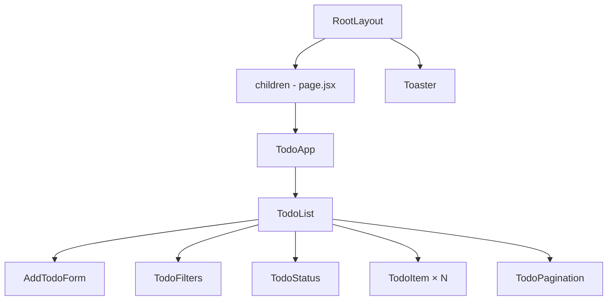
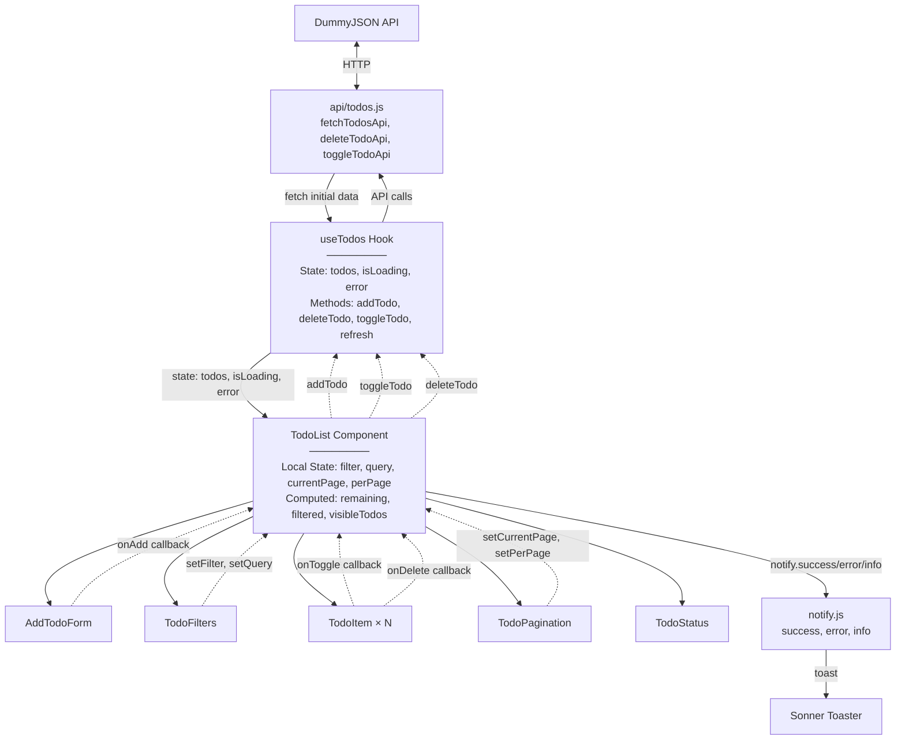

# 📝 Todo App - Task Management

Сучасний список завдань побудований на **Next.js 14 + React** з використанням **Hooks**, **TailwindCSS** та **REST API**.  
Повнофункціональний додаток для керування задачами з фільтрацією, пошуком, пагінацією та повідомленнями (**Sonner toast**).

---

## 🚀 Стек технологій

- [Next.js 14](https://nextjs.org/) – React фреймворк з App Router
- [React Hooks](https://react.dev/reference/react) – useState, useEffect, useCallback, useMemo
- [TailwindCSS v4](https://tailwindcss.com/) – utility-first стилізація
- [Axios](https://axios-http.com/) – HTTP клієнт для API запитів
- [Lucide Icons](https://lucide.dev/) – сучасна бібліотека іконок
- [Sonner](https://sonner.emilkowal.ski/) – елегантні toast повідомлення
- [DummyJSON API](https://dummyjson.com/) – тестовий REST API для завдань
- [Geist Font](https://vercel.com/font) – типографія від Vercel

---

## 📂 Структура проєкту

```
todo_list/lab4/
├── api/
│   └── todos.js              # API функції (fetch, delete, toggle)
├── app/
│   ├── layout.jsx            # Root layout з Toaster
│   ├── globals.css           # Tailwind + кастомні анімації
│   └── page.jsx              # Домашня сторінка
├── components/
│   ├── TodoApp.jsx           # Головний контейнер з заголовком
│   ├── TodoList.jsx          # Основна логіка + рендеринг
│   ├── AddTodoForm.jsx       # Форма додавання завдань
│   ├── TodoItem.jsx          # Окреме завдання (toggle/delete)
│   ├── TodoFilters.jsx       # Фільтри + пошук
│   ├── TodoStatus.jsx        # Стани: loading, error, empty
│   ├── TodoPagination.jsx    # Пагінація з вибором кількості
│   └── utils/
│       └── notify.js         # Обгортки для Sonner toast
└── hooks/
    └── useTodos.jsx          # Custom hook для роботи з API
```

---

## 🌳 Component Tree (CT)



### Опис Component Tree

Ця діаграма відображає **ієрархічну структуру компонентів** додатку:

- **RootLayout** – кореневий компонент Next.js, який обгортає весь додаток. Він містить глобальні налаштування (шрифти Geist) та підключає Toaster для відображення сповіщень.

- **Toaster**  – глобальний компонент від Sonner, який рендериться на рівні layout і відповідає за показ toast-повідомлень у правому верхньому куті екрану.

- **page.jsx** → **TodoApp** – точка входу сторінки, яка містить заголовок додатку з анімованим текстом та обгортає основну логіку в стилізовану картку.

- **TodoList** – центральний компонент, який керує всією логікою застосунку. Він містить стан (фільтри, пошук, пагінація), використовує custom hook `useTodos` та рендерить дочірні компоненти.

- **Дочірні компоненти TodoList**:
  - **AddTodoForm** – форма з інпутом та лічильником символів
  - **TodoFilters** – кнопки фільтрації (Усі/Активні/Виконані) + поле пошуку
  - **TodoStatus** – відображає стани завантаження, помилок або порожнього списку
  - **TodoItem × N** – окремі завдання, які рендеряться динамічно через `.map()`
  - **TodoPagination** – елементи керування сторінками та вибір кількості елементів

**Особливості структури:**
- Однонаправлений потік даних (top-down)
- Всі дані зберігаються в `TodoList` та передаються через props
- Компоненти максимально декомпозовані для переповторного використання

---

## 🔄 Data Flow Diagram (DF)



## 📋 Опис Data Flow

Ця діаграма показує **рух даних та взаємодію між різними частинами додатку**.

---

### 1️⃣ Зовнішній API шар

**DummyJSON API** – зовнішнє джерело даних (`https://dummyjson.com/todos`)

**api/todos.js** – проміжний шар абстракції з трьома функціями:

```javascript
// Завантажує список завдань з сервера
export const fetchTodosApi = async (limit = 20) => {
    const res = await axios.get(`${API_BASE}?limit=${limit}`);
    return res.data?.todos || [];
};

// Видаляє завдання на сервері (пропускає локальні)
export const deleteTodoApi = async (id) => {
    if (String(id).startsWith("local_")) return;
    await axios.delete(`${API_BASE}/${id}`);
};

// Змінює статус завдання на сервері (пропускає локальні)
export const toggleTodoApi = async (id, completed) => {
    if (String(id).startsWith("local_")) return;
    await axios.put(`${API_BASE}/${id}`, { completed });
};
```

**Важливо:** API функції **ігнорують локальні завдання** (id що починаються з `local_`)

---

### 2️⃣ Custom Hook шар (useTodos)

Центральний хук, який керує глобальним станом та взаємодією з API.

#### Стани:
- `todos` – масив усіх завдань (з API + локальні)
- `isLoading` – чи відбувається операція з API
- `error` – об'єкт помилки (або null)

#### Методи:

**addTodo(task)**
```javascript
const addTodo = useCallback((task) => {
    const newTodo = {
        id: `local_${Date.now()}`,
        todo: task,
        completed: false,
        userId: 0,
    };
    setTodos((prev) => [newTodo, ...prev]); // додає на початок масиву
    return newTodo;
}, []);
```
- Створює локальне завдання зі згенерованим id
- Не викликає API (це тільки клієнтська операція)

**deleteTodo(id)**
```javascript
const deleteTodo = useCallback(async (id) => {
    setIsLoading(true);
    setError(null);
    
    // ОПТИМІСТИЧНЕ ОНОВЛЕННЯ: спочатку видаляємо зі стану
    setTodos((prev) => prev.filter((t) => String(t.id) !== String(id)));
    
    try {
        await deleteTodoApi(id); // потім викликаємо API
    } catch (err) {
        setError(err);
        throw err; // пробрасуємо помилку для обробки в TodoList
    } finally {
        setIsLoading(false);
    }
}, []);
```
- **Оптимістично** видаляє зі стану перед викликом API
- Якщо API повертає помилку – стан не відкочується (користувач побачить помилку в toast)

**toggleTodo(id)**
```javascript
const toggleTodo = useCallback(async (id) => {
    setIsLoading(true);
    setError(null);

    // ОПТИМІСТИЧНЕ ОНОВЛЕННЯ: спочатку змінюємо стан
    setTodos((prev) =>
        prev.map((t) =>
            String(t.id) === String(id) ? { ...t, completed: !t.completed } : t
        )
    );

    const todo = todos.find((t) => String(t.id) === String(id));
    
    try {
        await toggleTodoApi(id, !todo.completed);
    } catch (err) {
        // ROLLBACK: якщо API зафейлився - повертаємо старий стан
        setTodos((prev) =>
            prev.map((t) =>
                String(t.id) === String(id) ? { ...t, completed: todo.completed } : t
            )
        );
        setError(err);
        throw err;
    } finally {
        setIsLoading(false);
    }
}, [todos]);
```
- **Оптимістично** змінює статус у стані
- **Відкочує зміни (rollback)** якщо API повертає помилку

**refresh()**
```javascript
const refresh = useCallback(() => fetchTodos(), [fetchTodos]);
```
- Перезавантажує всі завдання з API
- Викликається при помилці через кнопку "Спробувати ще раз"

---

### 3️⃣ Головний компонент (TodoList)

Оркеструє всю логіку UI та містить локальний стан для фільтрації.

#### Локальний стан:
```javascript
const [filter, setFilter] = useState("all");        // "all" | "active" | "completed"
const [query, setQuery] = useState("");             // пошуковий запит
const [currentPage, setCurrentPage] = useState(1);  // номер сторінки
const [perPage, setPerPage] = useState(10);         // 3 | 5 | 10 | 20 | -1 (всі)
```

#### Обчислювані значення (useMemo):

**remaining** – кількість невиконаних завдань
```javascript
const remaining = useMemo(() => 
    todos.filter((t) => !t.completed).length, 
    [todos]
);
```

**filtered** – завдання після застосування фільтра + пошуку
```javascript
const filtered = useMemo(() => {
    const q = query.trim().toLowerCase();
    return todos.filter((t) => {
        const matchesQuery = !q || String(t.todo || t.task || "").toLowerCase().includes(q);
        if (!matchesQuery) return false;
        
        if (filter === "all") return true;
        if (filter === "active") return !t.completed;
        if (filter === "completed") return t.completed;
        return true;
    });
}, [todos, filter, query]);
```

**visibleTodos** – завдання для поточної сторінки
```javascript
const totalPages = Math.max(1, Math.ceil(filtered.length / (perPage === -1 ? filtered.length : perPage)));
const startIndex = (currentPage - 1) * perPage;
const visibleTodos = perPage === -1 ? filtered : filtered.slice(startIndex, startIndex + perPage);
```

#### Обробники подій:

**handleAddTodo(task)**
```javascript
const handleAddTodo = (task) => {
    addTodo(task);                      // викликає хук
    notify.success("Завдання додано");  // показує toast
    setCurrentPage(1);                  // скидає на першу сторінку
};
```

**handleDelete(id)**
```javascript
const handleDelete = async (id) => {
    try {
        await deleteTodo(id);
        notify.error("Завдання видалено");
    } catch {
        notify.error("Не вдалося видалити");
    }
};
```

**handleToggle(id)**
```javascript
const handleToggle = async (id) => {
    try {
        await toggleTodo(id);
        notify.info("Статус оновлено");
    } catch {
        notify.error("Не вдалося оновити статус");
    }
};
```

**Важливо:** Всі нотифікації викликаються **тут в TodoList**, не в хуку!

---

### 4️⃣ UI Components (дочірні компоненти)

#### AddTodoForm
```javascript
<AddTodoForm onAdd={handleAddTodo} />
```
**Відповідальність:**
- Валідація input (не порожній, макс 100 символів)
- Лічильник символів з попередженням при перевищенні ліміту
- При сабміті викликає `onAdd(task)` → тригерить `handleAddTodo` у TodoList

**Власні toast:**
```javascript
if (len === 0) toast.error("Завдання не може бути порожнім");
if (len > MAX) toast.error(`Текст занадто довгий (максимум ${MAX} символів)`);
```

---

#### TodoFilters
```javascript
<TodoFilters 
    filter={filter} 
    setFilter={setFilter} 
    query={query} 
    setQuery={setQuery} 
    remaining={remaining} 
/>
```
**Відповідальність:**
- Три кнопки фільтрів (Усі / Активні / Виконані)
- Input для пошуку
- Відображення кількості активних завдань

**Ефект:**
```javascript
useEffect(() => setCurrentPage(1), [filter, query]); // при зміні фільтра/пошуку - скидає на 1 сторінку
```

---

#### TodoItem
```javascript
<TodoItem 
    key={todo.id}
    id={todo.id}
    task={todo.todo || todo.task}
    completed={todo.completed}
    onDelete={handleDelete}
    onToggle={handleToggle}
/>
```
**Відповідальність:**
- Кнопка checkbox → викликає `onToggle(id)`
- Іконка Trash2 → викликає `onDelete(id)`
- Перекреслений текст для виконаних завдань

---

#### TodoPagination
```javascript
<TodoPagination 
    currentPage={currentPage}
    totalPages={totalPages}
    perPage={perPage}
    setPerPage={setPerPage}
    setCurrentPage={setCurrentPage}
/>
```
**Відповідальність:**
- Селект "показувати по" (3, 5, 10, 20, Усі)
- Кнопки навігації ← →
- Відображення "Сторінка X з Y"

**Логіка:**
```javascript
onChange={(e) => { 
    setPerPage(Number(e.target.value)); 
    setCurrentPage(1); // скидає на першу сторінку при зміні perPage
}}
```

---

#### TodoStatus
```javascript
<TodoStatus
    status={isLoading ? "loading" : error ? "error" : visibleTodos.length === 0 ? "empty" : "ok"}
    message={error ? String(error.message || error) : "Немає завдань за критеріями"}
    onRetry={refresh}
/>
```
**Відповідальність:**
- `loading` → показує LoadingSpinner (три обертові кільця + анімовані крапки)
- `error` → показує помилку + кнопку "Спробувати ще раз" (викликає `refresh`)
- `empty` → показує "Немає завдань за критеріями"
- `ok` → нічого не рендерить (показуються TodoItem)

---

### 5️⃣ Notifications шар

#### notify.js
Утилітний модуль з функціями для toast повідомлень:

```javascript
export const notify = {
    success: (message) => toast.success(
        <span className="flex items-center gap-2">
            <CheckCircle2 className="w-5 h-5 text-green-500" /> {message}
        </span>
    ),
    error: (message) => toast.error(
        <span className="flex items-center gap-2">
            <Trash2 className="w-5 h-5 text-red-500" /> {message}
        </span>
    ),
    info: (message) => toast.info(
        <span className="flex items-center gap-2">
            <RefreshCw className="w-5 h-5 text-blue-500" /> {message}
        </span>
    ),
};
```

#### Sonner Toaster
Компонент з `layout.jsx`, який рендерить тости:
```javascript
<Toaster richColors position="top-right" />
```

**Важливо:** notify викликається **ТІЛЬКИ з TodoList та AddTodoForm**, НЕ з useTodos!

---

## 🔄 Типові сценарії використання

### Сценарій 1: Додавання нового завдання

1. Користувач вводить текст в input `AddTodoForm`
2. Натискає кнопку "Додати" (або Enter)
3. `AddTodoForm.handleSubmit`:
   - Валідує (не порожній, < 100 символів)
   - Викликає `onAdd(task)` → `TodoList.handleAddTodo`
4. `TodoList.handleAddTodo`:
   - Викликає `useTodos.addTodo(task)`
   - Показує `notify.success("Завдання додано")`
   - Скидає `currentPage` на 1
5. `useTodos.addTodo`:
   - Створює об'єкт з `id: local_${Date.now()}`
   - Додає на початок масиву `todos`
   - **НЕ викликає API** (це локальна операція)
6. React автоматично оновлює UI через реактивність

**Результат:** Нове завдання з'являється вгорі списку, зелений toast "Завдання додано"

---

### Сценарій 2: Видалення завдання

1. Користувач клікає 🗑️ в `TodoItem`
2. `TodoItem` викликає `onDelete(id)` → `TodoList.handleDelete`
3. `TodoList.handleDelete`:
   - Викликає `await deleteTodo(id)`
   - При успіху → `notify.error("Завдання видалено")`
   - При помилці → `notify.error("Не вдалося видалити")`
4. `useTodos.deleteTodo`:
   - **ОПТИМІСТИЧНО** видаляє зі стану: `setTodos(prev => prev.filter(...))`
   - Викликає `await deleteTodoApi(id)`
   - Якщо API повертає помилку → пробрасує її вгору
5. React автоматично оновлює UI

**Результат:** 
- Успіх: завдання зникає, червоний toast "Завдання видалено"
- Помилка: завдання зникає, але показується toast "Не вдалося видалити"

**Важливо:** При помилці видалення стан НЕ відкочується назад!

---

### Сценарій 3: Зміна статусу завдання

1. Користувач клікає checkbox в `TodoItem`
2. `TodoItem` викликає `onToggle(id)` → `TodoList.handleToggle`
3. `TodoList.handleToggle`:
   - Викликає `await toggleTodo(id)`
   - При успіху → `notify.info("Статус оновлено")`
   - При помилці → `notify.error("Не вдалося оновити статус")`
4. `useTodos.toggleTodo`:
   - **ОПТИМІСТИЧНО** змінює статус: `setTodos(prev => prev.map(...))`
   - Зберігає старий стан в `todo.completed`
   - Викликає `await toggleTodoApi(id, !todo.completed)`
   - При помилці → **ROLLBACK**: відкочує зміни назад
5. React автоматично оновлює UI

**Результат:**
- Успіх: checkbox змінюється, текст перекреслюється, синій toast
- Помилка: checkbox повертається назад, червоний toast

**Важливо:** toggleTodo робить ROLLBACK при помилці, на відміну від deleteTodo!

---

### Сценарій 4: Фільтрація та пошук

1. Користувач вводить текст в input `TodoFilters`
2. `onChange` викликає `setQuery(e.target.value)`
3. `useEffect(() => setCurrentPage(1), [query])` скидає на 1 сторінку
4. `filtered` (useMemo) перераховується:
   ```javascript
   todos.filter(t => t.todo.toLowerCase().includes(query.toLowerCase()))
   ```
5. `visibleTodos` оновлюється відповідно до нової сторінки
6. React автоматично оновлює список `TodoItem`

**Результат:** Список показує тільки завдання, що містять пошуковий запит

---

### Сценарій 5: Обробка помилки завантаження

1. При монтуванні `useTodos` викликає `fetchTodos()`
2. Якщо API недоступний → `catch (err) { setError(err) }`
3. `TodoList` отримує `error !== null`
4. `TodoStatus` рендерить стан "error":
   - Заголовок "Помилка"
   - Текст помилки
   - Кнопка "Спробувати ще раз"
5. Користувач клікає кнопку → викликається `refresh()`
6. `refresh` → `fetchTodos()` → повторний запит до API

**Результат:** Можливість повторного завантаження при проблемах з мережею

---

## ⚙️ Основні Hooks

### `useState`
- **AddTodoForm** – `task` (текст форми), валідація довжини
- **TodoList** – `filter` (all/active/completed), `query` (пошук), `currentPage`, `perPage`
- **useTodos** – `todos[]`, `isLoading`, `error`

### `useEffect`
- **useTodos** – автоматичне завантаження завдань при монтуванні
- **TodoList** – скидання сторінки при зміні фільтра/пошуку

### `useCallback`
- **useTodos** – `fetchTodos`, `addTodo`, `deleteTodo`, `toggleTodo`, `refresh` (мемоізація функцій)

### `useMemo`
- **TodoList** – `remaining` (кількість активних), `filtered` (фільтровані завдання), `visibleTodos` (для пагінації)

### Приклад використання:

```javascript
// useTodos.jsx
const addTodo = useCallback((task) => {
  const newTodo = {
    id: `local_${Date.now()}`,
    todo: task,
    completed: false,
    userId: 0,
  };
  setTodos((prev) => [newTodo, ...prev]);
  return newTodo;
}, []);

// TodoList.jsx
const filtered = useMemo(() => {
  const q = query.trim().toLowerCase();
  return todos.filter((t) => {
    const matchesQuery = !q || String(t.todo || t.task || "").toLowerCase().includes(q);
    if (!matchesQuery) return false;
    if (filter === "all") return true;
    if (filter === "active") return !t.completed;
    if (filter === "completed") return t.completed;
    return true;
  });
}, [todos, filter, query]);
```

---

## 🔌 API інтеграція

### Модуль `api/todos.js`

```javascript
import axios from "axios";

const API_BASE = "https://dummyjson.com/todos";

// Завантаження списку завдань
export const fetchTodosApi = async (limit = 20) => {
    const res = await axios.get(`${API_BASE}?limit=${limit}`);
    return res.data?.todos || [];
};

// Видалення завдання
export const deleteTodoApi = async (id) => {
    if (String(id).startsWith("local_")) return; // Локальні не видаляємо через API
    await axios.delete(`${API_BASE}/${id}`);
};

// Зміна статусу
export const toggleTodoApi = async (id, completed) => {
    if (String(id).startsWith("local_")) return;
    await axios.put(`${API_BASE}/${id}`, { completed });
};
```

**Особливості:**
- Локальні завдання (`local_*`) не надсилаються до API
- Axios обробляє помилки через try/catch в `useTodos`

---

## ▶️ Запуск проєкту

```bash
# 1. Клонувати репозиторій
git clone https://github.com/username/todo-app.git
cd todo-app/lab4

# 2. Встановити залежності
npm install

# 3. Запустити dev-сервер
npm run dev

# 4. Відкрити в браузері
http://localhost:3000
```

---

## 📌 Функціонал

### ✅ Основні можливості
- **Завантаження з API** – початкові дані з DummyJSON (50 завдань)
- **Додавання завдань** – валідація до 100 символів, лічильник
- **Видалення** – з підтвердженням через toast
- **Toggling статусу** – позначка виконано/активно
- **Фільтрація** – Усі / Активні / Виконані
- **Пошук** – live search по тексту завдання
- **Пагінація** – 3/5/10/20 або "Усі" на сторінці
- **Toast повідомлення** – Sonner для всіх дій
- **Responsive дизайн** – адаптивний на всіх екранах

### 🎨 Візуальні ефекти
- **Gradient фон** – анімована зміна кольорів (`gradientFlow`)
- **Glow ефект** – пульсуючий текст заголовка
- **Fade-in анімації** – плавна поява елементів
- **Loading spinner** – багаторівневий обертальний індикатор
- **Task animations** – плавне перетворення при зміні статусу

---

## 🔧 Деталі реалізації

### Управління станом
```javascript
// Централізований стан в useTodos hook
const [todos, setTodos] = useState([]);
const [isLoading, setIsLoading] = useState(false);
const [error, setError] = useState(null);

// Immutable оновлення стану
setTodos((prev) => [newTodo, ...prev]);
setTodos((prev) => prev.filter((t) => String(t.id) !== String(id)));
setTodos((prev) => prev.map((t) => 
  String(t.id) === String(id) ? { ...t, completed: !t.completed } : t
));
```

### Оптимізація продуктивності
- **useCallback** – запобігання повторному створенню функцій
- **useMemo** – кешування відфільтрованих результатів
- **String conversion** – нормалізація ID для порівняння

### Обробка помилок
```javascript
const handleDelete = async (id) => {
  try {
    await deleteTodo(id);
    notify.success("Завдання видалено");
  } catch {
    notify.error("Не вдалося видалити");
  }
};
```

### Стилізація
- **Tailwind v4** – нові `@theme inline` директиви
- **CSS змінні** – кольорова схема через `oklch()`
- **Backdrop blur** – ефект розмиття для карток
- **Градієнти** – 4-кольоровий анімований фон

---

## 🎨 Кастомні анімації

```css
/* Пульсуючий текст */
.text-glow {
  text-shadow: 0 0 6px rgba(255,255,255,0.7);
  animation: glow-pulse 3s ease-in-out infinite;
}

/* Анімований градієнт */
.gradient-bg {
  background: linear-gradient(270deg, #E7D2CF, #C7CECB, #6CBEBF, #027683);
  background-size: 800% 800%;
  animation: gradientFlow 20s ease infinite;
}

/* Плавна поява */
@keyframes fade-in {
  from { opacity: 0; transform: translateY(10px); }
  to { opacity: 1; transform: translateY(0); }
}
```

---

## 📊 Статистика та метрики

```javascript
// Підрахунок активних завдань
const remaining = useMemo(() => 
  todos.filter((t) => !t.completed).length, 
  [todos]
);

// Відображення
{todos.length} завдань всього — {remaining} left
```

---

## 🧪 Тестові сценарії

1. **Завантаження** – перевірка loading state
2. **Додавання** – валідація порожнього поля та ліміту символів
3. **Фільтрація** – перемикання між all/active/completed
4. **Пошук** – live filtering по тексту
5. **Пагінація** – зміна кількості елементів на сторінці
6. **Toggle** – зміна статусу з анімацією
7. **Видалення** – оптимістичне оновлення UI

---

## 💡 Висновок

Цей проєкт демонструє:

- 🏗️ **Модульну архітектуру** з розділенням на API/Hooks/Components
- 🔄 **Оптимізований Data Flow** через custom hooks
- ⚡ **Performance optimization** з useCallback та useMemo
- 🎨 **Сучасний UI/UX** з анімаціями та responsive дизайном
- 🌐 **REST API інтеграція** з обробкою помилок
- 📱 **Повністю адаптивний** на всіх пристроях
- 🔔 **Rich notifications** через Sonner
- 🎯 **Повноцінна пагінація** з фільтрацією та пошуком

---

## 📝 Додаткові нотатки

- Локальні завдання отримують префікс `local_` для відрізнення від серверних
- API запити обробляються оптимістично (UI оновлюється одразу)
- При помилках стан відкочується до попереднього значення
- Валідація тексту: мінімум 1 символ, максимум 100
- Фільтри та пошук працюють незалежно один від одного

